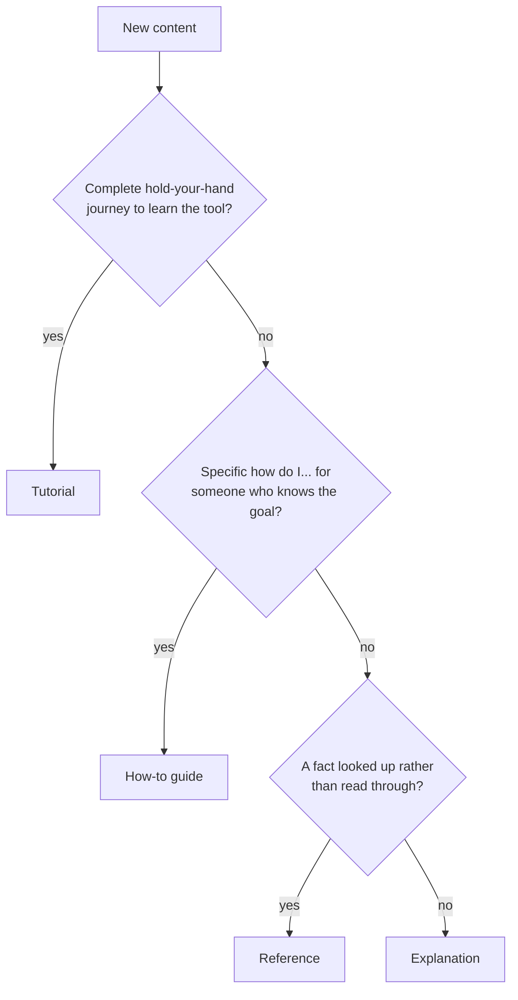

# The LaNorme documentation architecture

This page is the contributor's guide to where documentation lives. It tells you, for any piece of content you are about to write, which kind of page it belongs on, what to name the file, and how to draw a diagram. Follow it and every page on the site stays familiar: a reader who learns the shape once can navigate anything.

It is an explanation page on purpose. It does not teach a task or list config keys; it explains the reasoning behind the layout so the layout makes sense rather than being a rule you obey blindly. If you only read one section, read the decision guide.

## The four kinds of page (Diataxis)

LaNorme's documentation follows the Diataxis framework. Every page serves exactly one of four reader needs, and the four are kept apart because mixing them is what makes documentation hard to use. A reader trying to get a job done does not want theory in the way; a reader trying to understand does not want a step list. The four quadrants split along two axes: whether the reader is *studying* or *working*, and whether the page is about *practical steps* or *theoretical knowledge*.

| Quadrant | Orientation | The reader's question | LaNorme example |
| --- | --- | --- | --- |
| **Tutorial** | learning | "Teach me by doing." | Adopt LaNorme on a brownfield repo, recording a baseline so only new findings fail |
| **How-to guide** | task | "How do I accomplish X?" | Promote an advisory warning to a build-failing error |
| **Reference** | information | "What exactly is X?" | Every `[tool.lanorme]` config key; every rule code |
| **Explanation** | understanding | "Why is it built this way?" | Why a false positive is the cardinal sin |

These map one-to-one onto LaNorme's four flagship pages, which already conform: `tutorials/adopt-on-existing-codebase.md`, `how-to/promote-warnings.md`, `reference/configuration.md`, `explanation/precision-first.md`. When in doubt, open the matching flagship page and copy its shape.

## Decision guide: which quadrant does my content belong in?

Ask these questions in order. The first "yes" wins.



1. **Is it a complete, hold-your-hand journey a newcomer follows start to finish to learn how the tool feels?** It is a **tutorial**. There is usually only one tutorial per major workflow; tutorials are scarce on purpose. The reader is learning, not solving a specific problem of their own. Example: "adopt LaNorme on an existing codebase" walks the whole baseline onboarding even though the reader has no specific failing rule in mind yet.

2. **Does it answer a specific "how do I ...?" for someone who already knows what they want?** It is a **how-to guide**. It assumes competence, states a goal, and gives the shortest correct path. Examples: "promote a warning", "exclude a path", "use a profile", "write a check". How-to guides are the most numerous section and the easiest to add.

3. **Is it a fact a reader looks up rather than reads through, a complete and accurate description of one surface of the tool?** It is **reference**. Examples: every config key, every rule code, every CLI flag. Reference is dry, exhaustive, and structured for lookup, not narrative. Much of it is generated (see below).

4. **Otherwise it is explanation.** If the content exists to make the reader *understand* a decision, a trade-off, or a concept (the cardinal-sin principle, why the tool is stdlib-only, why the baseline is content-anchored, this very page), it is an **explanation**. Explanation is the only quadrant that may argue, contextualise, and discuss alternatives.

Two traps to avoid:

- **Do not mix quadrants on one page.** If a reference page starts explaining *why*, move the why to an explanation page and link to it. If a how-to starts teaching from scratch, it wants to be a tutorial or to link to one.
- **Verb-led naming does not decide the quadrant.** Both tutorials and how-to guides are written as actions ("adopt ...", "promote ..."), so the file name cannot tell them apart. What separates them is reader intent: a tutorial is for *learning the tool*; a how-to is for *getting a specific job done*. Decide on intent, then name the file.

## Directory layout

The four quadrants are the four directories under `docs/`. The layout *is* the architecture; putting a file in a directory is how you declare its kind.

```
docs/
  index.md                  # the site landing page (known top-level)
  RULES.md                  # the authored rule reference (known top-level)
  tutorials/                # learning-oriented, complete journeys
  how-to/                   # task-oriented recipes
  reference/                # information-oriented, lookup
  explanation/              # understanding-oriented, the "why"
```

Every published Markdown page lives in one of the four section directories or is one of the two known top-level pages, `index.md` and `RULES.md`. There is no third option for published content. (Working documents are handled separately; see "Working documents" below.)

## The skimmer line

Every content page opens with a **skimmer**: a one-line scope statement placed as the first prose paragraph immediately under the H1, before any sub-heading, list, table, or code block. It is the page's promise of scope, so a reader (human or agent) learns what the page covers within one paragraph of the title.

The skimmer must begin with a literal opener naming the page kind, drawn from a fixed set: "This page ...", "This tutorial ...", "This guide ...", "This reference ...", "This how-to ...", or "This explanation ...". That opener is required, not merely recommended; the `docs` check (`DOCS-003`) treats it as a closed whitelist and accepts no other phrasing. A near-miss such as "This recipe ...", "Use this how-to ...", or any opener that does not start with one of those six exact phrases is flagged as a build-failing error. The skimmer must also be a plain prose paragraph: a leading mkdocs-material admonition (`!!! note`) or a blockquote callout under the H1 does *not* satisfy the rule, because the check reads the first non-blank prose line and requires the canonical opener there. Index and home pages are exempt, since their body is legitimately a list.

## Naming convention

File names are **kebab-case** (lowercase words joined by hyphens), with the `.md` extension. The name describes the page's content, not its position.

- **How-to** files are **verb-led**, naming the task: `promote-warnings.md`, `configure-checks.md`, `use-profiles.md`, `write-a-check.md`.
- **Tutorials** are also action-phrased but read as a guided journey: `adopt-on-existing-codebase.md`. (As noted above, the verb does not classify the page; the directory does.)
- **Reference** files are **noun-led**, naming the thing described: `configuration.md`, `rules-index.md`, `cli.md`.
- **Explanation** files are **noun phrases** naming the concept: `precision-first.md`, `docs-architecture.md`.

Each section should carry an `index.md` that lists its pages, so a reader landing on the section has a map. The site navigation in `mkdocs.yml` lists pages explicitly; a new page is not visible until it is added to the `nav`.

## Headings and numbering

Headings descend without gaps: an H2 is followed by an H2 or an H3, never an H4. There is exactly one H1, the title. Do **not** manually number sections (`## 1. Setup`, `### 2.3) Details`): mkdocs auto-generates the on-page table of contents from the heading text, so explicit numbers duplicate it and rot when sections are reordered. A digit-led title without a trailing dot or paren, like `## 30-second example`, is fine. Do not hand-write an in-page table of contents on a content page; the mkdocs ToC already covers it. An explicit list of pages belongs only on a section index page.

## Diagrams

The default diagram format is **Mermaid** in a ```` ```mermaid ```` fence. The source lives in the Markdown, so an agent reads the same artifact a human sees rendered to SVG. Use it for flowcharts, sequence diagrams, and state, relationship, or class diagrams (the decision guide above is one).

For richer visuals Mermaid cannot express, use a hand-authored **`.svg`** referenced with `` or ``. The alt text is the agent's and the screen-reader's text alternative and is **mandatory on every image**, decorative ones included: the `docs` check (`DOCS-004`) flags an empty alt, whether an empty-string `alt=""` attribute or a Markdown image with empty brackets, as a build-failing error exactly as it flags a missing one. There is no decorative escape hatch, so describe what the image shows even when it is ornamental. A Mermaid fence is its own text alternative and needs no alt.

**Raster** formats (`.png`, `.jpg`, and friends) are discouraged for diagrams: they are opaque to an agent and do not scale. A genuine UI screenshot or photo is legitimate raster and stays allowed; the discouragement is an escapable nudge, not a hard rule. Rendering Mermaid to SVG requires the `pymdownx.superfences` custom_fence named `mermaid` in `mkdocs.yml`; without it, Mermaid blocks dump as raw code.

## Reference: generated versus authored

Reference is the quadrant most likely to drift from the tool, so LaNorme generates the parts that are pure fact and authors the parts that are explanation-with-structure. The two must never be confused.

**Generated reference pages are produced by `scripts/gen_docs.py` and are never hand-edited.** Exactly two pages under `docs/` are generated today:

- `reference/configuration.md` — every top-level `[tool.lanorme]` key, its type and default, emitted from the config-key source of truth.
- `reference/rules-index.md` — the code-to-check-to-opt-in table, emitted from the live rule registry.

(The script also writes `lanorme.schema.json`, `llms.txt`, and `llms-full.txt` at the repo root; those are outside `docs/`.)

Each generated page opens with a sentence stating it is generated from the tool "so it cannot drift". To change a generated page you change the tool or the generator, then run `python3 scripts/gen_docs.py`. A documentation page that contradicts the tool is itself a false positive, so this is non-negotiable. CI enforces it: `python3 scripts/gen_docs.py --check` exits non-zero if any committed generated file is stale. **Do not reimplement that staleness check inside the linter** — it already exists, and duplicating it imprecisely would risk firing on files a contributor legitimately regenerated.

**The other two reference pages are authored and meant to be hand-edited:**

- `RULES.md` — what each rule catches, why, and its precision notes. This is prose with structure, not a generated table, so it is authored. (It is concatenated into `llms-full.txt` by the generator, but it is not generated.)
- `reference/cli.md` — the command and flag reference, authored.

The dividing line: if a page is a mechanical projection of a data structure in the code, it is generated; if it is human-written description that happens to be organised for lookup, it is authored.

## Working documents

Corpus designs, corpus audits, and the multi-reviewer audit live under `docs/` for convenience but are *not* part of the published site. They are working documents: `*-design.md`, `*-corpus-design.md`, `*-corpus-audit.md`, and anything under `docs/audit/`. `mkdocs.yml` already excludes exactly these through its `exclude_docs` setting, and the docs check exempts the same globs so they are never asked to fit a quadrant. If you add a new working document, match one of those name patterns (or place it under `docs/audit/`) so both the site build and the check leave it alone.

## Where this page lives, and why

This page is `explanation/docs-architecture.md`. It is an explanation because it explains a design decision (the layout) rather than teaching a task or listing facts. It is also the contributor's guide: when someone asks "where does this new page go?", the answer is "read `explanation/docs-architecture.md` and run the decision guide". Linking new contributors here keeps the architecture self-documenting and self-enforcing.

## Mechanically checkable rules

The architecture, the page conventions, and the diagram policy are enforced by one new opt-in check, `docs`, defaulting **off** like `prose` and `skills`, because these are LaNorme's house standards and must not be imposed on a repository with a different docs structure. Its section directories, known top-level pages, and raster extensions are configurable via `[tool.lanorme.docs]`, defaulting to LaNorme's own layout. LaNorme enables it on itself and dogfoods to zero hard-error findings.

Only objective, measured-clean conventions are **errors**; every subjective convention is an advisory **warning**, so the cardinal sin (a false positive on genuinely good docs) is structurally avoided.

- **Errors:** `DOCS-001` exactly one H1, `DOCS-002` heading levels descend one step at a time, `DOCS-003` a content page opens with a canonical skimmer line, `DOCS-004` every image carries non-empty alt text (an empty `alt=""` is flagged like a missing one, including for decorative images).
- **Warnings:** `DOCS-005` prefer SVG or Mermaid over a local raster image, `DOCS-006` each section directory carries an `index.md`, `DOCS-007` every page has a home in the architecture (a known section or top-level page), `DOCS-008` headings are not numbered by hand.

Separately, the em-dash ban (`PROSE-001`) is relaxed inside `docs/` by a `docs/lanorme.toml` region that swaps it for an advisory **em-dash density** rule (`PROSE-004`): em dashes are welcome at the proportion and distribution of natural edited English, and only sustained LLM-style overuse (a high per-1,000-word rate *and* an em dash in most sentences) is flagged, as a warning.

Keeping the error set small, objective, and measured to zero on the current corpus, and leaving everything subjective advisory and configurable, is what keeps the check precision-first: it fires only inside a project that has adopted this architecture, and even there only on a genuinely misfiled, mis-marked, or mis-structured page.