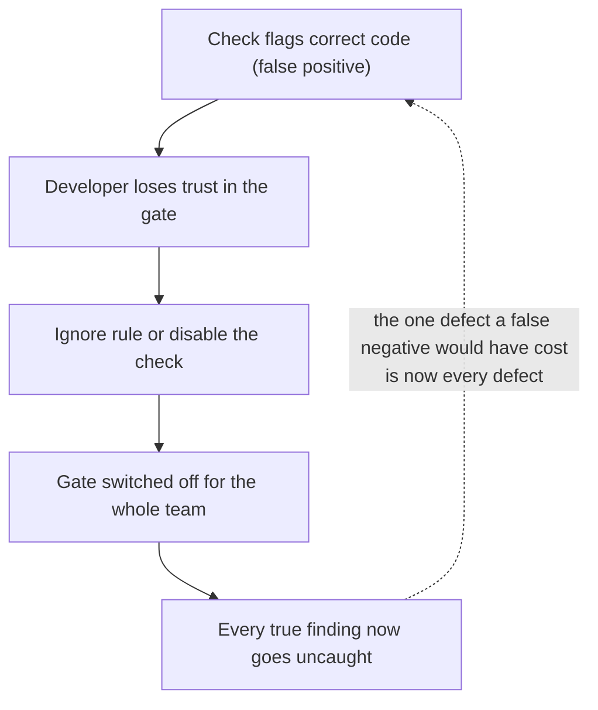

# Why LaNorme is precision-first

This explanation traces how one goal, making a team's codebase standard
executable and trustworthy enough to gate every commit, drives every design
choice in the tool: the false-positive budget, the baseline, the stdlib-only
stance, and the generated docs.

LaNorme exists to do one thing well: make a team's codebase standard executable
and trustworthy enough to gate every commit. Every design choice in the tool
follows from that goal. The reasoning below ties the rules, the baseline, and
the documentation together as parts of a single idea rather than a list of
features.

## The thesis: an executable standard

Most teams already have a standard. It lives in a style guide, in review
comments, in the habits of whoever has been around longest. The problem is not
that the standard is unwritten; the problem is that it is unenforced. A rule
that depends on a human noticing it in review is applied unevenly, argued about
case by case, and quietly dropped under deadline pressure.

LaNorme turns that standard into checks that run the same way every time, on
every change, with no human in the loop. `lanorme check .` either passes or it
does not, and the exit code says which: `0` when clean, `1` when there are
findings, `2` on a usage or configuration error. That last property is what
lets the command drop straight into a pre-commit hook or a CI step. A standard
you can put behind a gate is a standard the team actually has.

But a gate is only useful if people leave it switched on. Everything below is
about earning and keeping that permission.

## A false positive is the cardinal sin

The fastest way to kill a linter is to make it cry wolf. The first time a
developer is blocked by a finding that is obviously wrong, they lose trust. The
third time, they add an ignore. Soon the whole tool is disabled, and with it
goes every true finding it would have caught. A linter spends trust on every
false positive, and it has a limited supply.



The spiral is why precision is weighted so far above recall: a single
unjustified block does not cost one finding, it risks the entire gate, and a
gate nobody trusts catches nothing at all.

So LaNorme treats a false positive as the cardinal sin and a false negative as
a tolerable cost. When a check cannot be sure, it stays quiet. It would rather
miss a real problem than flag code that is fine, because a missed problem costs
you one defect while a false alarm costs you the tool.

This is not a slogan; it is visible in how individual checks are built. The
`CMT-005` restating-comment check (experimental, opt-in) is the clearest case.
Its design refuses to chase comments that paraphrase code with synonyms,
because doing so reliably produces false positives. The result, measured on its
bundled corpus, is `P = 1.000 / R = 0.418`: perfect precision, deliberately
sacrificed recall. It catches fewer than half the restating comments it could,
and that is the correct trade for a check meant to run on every commit.

The same instinct shows up in checks that parse uncertain input. The
`SKILL-*` frontmatter checks read `SKILL.md` metadata with a stdlib-only
parser that never turns its own uncertainty into a failure: if a required value
cannot be read cleanly, the check warns (`SKILL-006`) rather than reporting the
value as missing and failing the build on what might be a parse limitation
rather than a real defect.

This is also why most findings begin life as advisory warnings rather than
errors. A warning informs without blocking. You decide, explicitly, which
advisories are important enough to fail a build, and you do it with
[`promote`](../reference/configuration.md#promote). On a clean run a warning
leaves the exit code at `0`; promote that rule and the same finding fails with
exit `1`. The tool does not presume to know which of your standards are
hard lines. You tell it, and until you do, it stays out of your way. See
[Promote advisory warnings to build-failing errors](../how-to/promote-warnings.md).

## It dogfoods itself

LaNorme runs its own checks on its own source and its own documentation. The
project's `pyproject.toml` enables the same rules it ships, including the opt-in
ones, and ignores only the rules that assume a layered domain application
(`LAYER`, `PORT`, `TERM`) because LaNorme is a flat library, not a hexagonal
app.

Dogfooding is not vanity. It is the cheapest way to keep precision honest. If a
check is noisy, the people most exposed to that noise are the maintainers,
every time they commit. A false positive in LaNorme's own rules blocks
LaNorme's own pipeline, so there is no incentive to ship a check that cries
wolf and tell users to "just ignore it". The cost lands on the author first.

This page is itself subject to that discipline. The prose checks
(`PROSE-001/002/003`) lint LaNorme's Markdown for em dashes, American
spellings, and emoji, which is why this document avoids all three.

## It is stdlib-only

LaNorme has zero runtime dependencies. Every check is built on the Python
standard library: the `ast` module to read code, `hashlib` for fingerprints,
`tomllib` for config, nothing else.

This is a trust decision as much as a convenience one. A tool meant to gate
every commit sits on the critical path of every developer and every CI run.
Each dependency it pulls in is a thing that can break a release, introduce a
security advisory, or fail to install on someone's machine and take the gate
down with it. A linter that cannot be installed is a linter that gets removed
from the pipeline. Standing on the stdlib alone keeps the install trivial and
the supply chain short, which keeps the gate up.

It also keeps the checks honest about what they can know. An `ast`-based check
sees exactly what Python's own parser sees, no more. That bounded view is part
of why the precision-first promise is keepable: the tool does not pretend to
understand more than it does.

## The baseline is content-anchored

Real teams adopt a linter on a codebase that already has problems. If turning
the tool on means fixing every pre-existing finding before a single commit can
land, nobody turns it on. The baseline solves this. `lanorme baseline write`
records the findings a codebase already has into `lanorme-baseline.json`; from
then on those recorded findings are suppressed, and only new findings report.
You adopt strict rules and a baseline together, and every new line is held to
strict from day one of a legacy repo.

The hard part is matching a recorded finding to a current one across edits, and
this is where the design earns its trust. The baseline is content-anchored, not
line-number-anchored. Each finding is keyed by `(file, rule code, anchor)`,
where the anchor is a hash of the stripped source line at the finding (or, for
a whole-file finding reported at a line-1 sentinel, a hash of the static rule
description). Hashing every form keeps source text, and any secret, out of the
committed file.

Three properties follow from that, and each one defends the tool's
trustworthiness from a different angle.

**An entry survives edits above it.** Because the anchor is the content of the
finding's own line, not its line number, inserting an import or a docstring
higher up in the file does not move the anchor. A recorded finding stays
recorded. Without this, every unrelated edit would resurrect a pile of
suppressed warnings, and the baseline would be useless within a week.

You can watch this directly. Record a finding, insert two lines above it, and
re-check:

```console
$ lanorme baseline write
Wrote 1 baseline entry (1 finding): +1 new, -0 pruned (was 0).
$ lanorme check
All 25 checks passed.
```

**It never resurrects paid-down noise.** When you fix a finding, its entry no
longer matches anything. `lanorme baseline status` lists those stale entries so
you can see what you have paid down, and the next `lanorme baseline write`
prunes them. The baseline shrinks as the debt shrinks; it does not accumulate
phantom entries that re-fire on a coincidental content match.

```console
$ lanorme baseline status
1 stale baseline entry (matched nothing this run):
  dirty.py  SHELL-001

Run 'lanorme baseline write' to prune them.
```

**It never hides new debt.** Two guards enforce this. A per-key count budget
means that if the baseline recorded N occurrences of a finding, the (N+1)th
still reports: adding a second `os.system(...)` next to a baselined one
surfaces immediately, because its line content hashes to a different anchor and
exceeds the recorded count. And a severity gate means a baselined *warning*
never suppresses a current *error*-tier finding, so a file that has been edited
until it crosses a hard threshold re-reports and fails the build. Debt that
gets worse is new debt, and new debt always surfaces.

When you want to see the whole picture, ignore the baseline for one run:

```console
$ lanorme check --no-baseline
...
--- security_calls: 1 violations, 0 warnings ---
```

The run exits `1`, reporting the violation the baseline had been holding back.

The baseline, in short, is built so that it can only ever forgive the past, not
the future. That is what makes it safe to gate on. For the full adoption path,
see [Adopt LaNorme on an existing codebase](../tutorials/adopt-on-existing-codebase.md).

## Facts in these docs are generated from the tool

A documentation page that contradicts the tool is itself a false positive: it
teaches a reader something that is not true, and it spends the same trust. So
the load-bearing facts in this documentation are generated from LaNorme rather
than written from memory.

The clearest example is the [configuration reference](../reference/configuration.md).
Every top-level key in the `[tool.lanorme]` table (`select`, `ignore`,
`exclude`, `per-file-ignores`, `promote`, `extends`, `baseline`, `source_root`,
`plugins`) is generated from the tool, so the reference cannot drift from the
code. The [rule index](../reference/rules-index.md) is likewise derived from the
live rule registry, the same one `lanorme rules` prints. Precision-and-recall
figures quoted for a check, such as the `CMT-005` numbers above, come from a
scorer run against a bundled corpus, not from a guess.

This closes the loop. The tool makes the standard executable; the docs make the
tool's own behaviour checkable; and dogfooding makes both true of LaNorme
itself. The whole system is built so that the thing you read, the thing you run,
and the thing you gate on are the same thing.

## Where to go next

- [Configuration reference](../reference/configuration.md) for every config key.
- [Rules reference](../RULES.md) for what each check catches and what it does not.
- [Adopt LaNorme on an existing codebase](../tutorials/adopt-on-existing-codebase.md) to put a baseline behind a strict gate.
- [Use configuration profiles](../how-to/use-profiles.md) to adopt `strict`, `hexagonal`, `clean`, or `layered` with `extends`.
