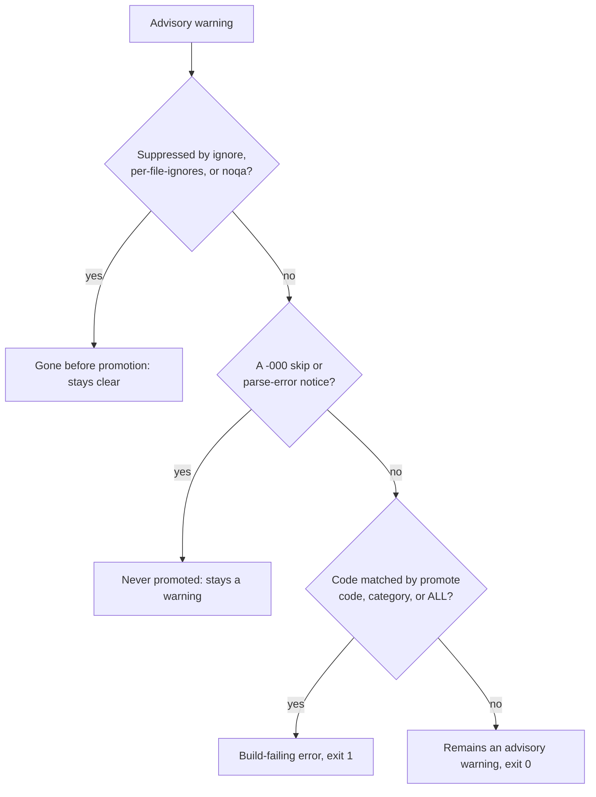

# Promote advisory warnings to build-failing errors

This how-to shows how to turn an advisory warning into a build-failing error with `promote`, and explains how promotion interacts with suppression, skip notices, and the `strict` profile.

A warning is only ever promoted if it survives every suppression mechanism first, and skip notices are never promoted at all. The decision a single warning runs through is:



Some rules report at the advisory tier: they raise a warning, but the run
still exits `0`. `TYPE-004` (a function with typed parameters and a real
return value should declare a return type) is one such rule. When you want
an advisory rule to break the build instead, promote it.

Promotion escalates a warning into a build-failing error. The run then exits
`1`, the same as any other finding, so continuous integration stops on it.

## Promote a single rule

Add the rule code to `promote` in `[tool.lanorme]`:

```toml
[tool.lanorme]
promote = ["TYPE-004"]
```

This is the `pyproject.toml` form. In a standalone `lanorme.toml` the prefix is
dropped, so write `promote = ["TYPE-004"]` at the top level with no
`[tool.lanorme]` header (a `[tool.lanorme]` header there is silently ignored).
See the [configuration reference](../reference/configuration.md) for the header
convention.

A category works too (`promote = ["TYPE"]`), as does the whole catalogue:

```toml
[tool.lanorme]
promote = ["ALL"]
```

The same applies on the command line, where `--promote` takes a
comma-separated list of codes, categories, or `ALL`. A command-line flag
overrides the config value for that run.

```bash
lanorme check src --promote TYPE-004
lanorme check src --promote ALL
```

## Before and after

Start with a function that has typed parameters but no return annotation:

```python
def total_price(quantity: int, unit_price: float):
    return quantity * unit_price
```

Without promotion, `TYPE-004` reports as a warning and the run still passes:

```console
$ lanorme check orders.py --select TYPE-004
[WARN] strong_types
  VIOLATION: orders.py:1 — 'total_price' has annotated parameters and returns a value but no return annotation. Declare the return type so the signature is complete.
    Rule: TYPE-004
    Fix: Add a return annotation (for example '-> ResultType') to the signature
--- strong_types: 0 violations, 1 warnings ---

Summary: 25 checks — 24 passed, 1 warnings, 0 failed.
$ echo $?
0
```

Promote it, and the same finding becomes a failure with exit code `1`:

```console
$ lanorme check orders.py --select TYPE-004 --promote TYPE-004
[FAIL] strong_types
  VIOLATION: orders.py:1 — 'total_price' has annotated parameters and returns a value but no return annotation. Declare the return type so the signature is complete.
    Rule: TYPE-004
    Fix: Add a return annotation (for example '-> ResultType') to the signature
--- strong_types: 1 violations, 0 warnings ---

Summary: 25 checks — 24 passed, 0 warnings, 1 failed.
$ echo $?
1
```

The exit code is the signal CI reads: `0` clean, `1` findings, `2` usage or
config error. See the [configuration reference](../reference/configuration.md)
for the full table of keys and their command-line equivalents.

## Promotion runs after suppression

Promotion is the last step. It runs after every suppression mechanism, so a
warning that is already silenced is gone before promotion can see it. A code
listed in `ignore`, matched by `per-file-ignores`, or carrying a `# noqa`
comment is never promoted, even under `promote = ["ALL"]`.

A `# noqa` on the line suppresses the warning, so `--promote ALL` has nothing
to escalate and the run passes:

```python
def total_price(quantity: int, unit_price: float):  # noqa: TYPE-004
    return quantity * unit_price
```

```console
$ lanorme check orders.py --select TYPE-004 --promote ALL
All 25 checks passed.
$ echo $?
0
```

The same holds for `ignore`. Ignoring and promoting the same code leaves
nothing to promote:

```console
$ lanorme check orders.py --select TYPE-004 --ignore TYPE-004 --promote TYPE-004
All 25 checks passed.
$ echo $?
0
```

>!!! note
>    This ordering means promotion cannot resurrect a finding you have
>    deliberately suppressed. If you want a suppressed warning to fail the
>    build, remove the suppression first, then promote.

## Skip notices are never promoted

A `-000` code (for example `TYPE-000`, `DRY-000`, `LAYER-000`) is a
skip or parse-error notice, not a finding. It means "could not analyse this
file, skipping", typically because of a syntax error. These notices stay
warnings even under `promote = ["ALL"]`, so promotion never fails a build on
a non-issue.

Running a check over a file with a syntax error, with `--promote ALL`:

```console
$ lanorme check broken.py --check strong_types --promote ALL --output-format full
[WARN] strong_types
  VIOLATION: broken.py:0 — Could not parse broken.py — skipping
    Rule: TYPE-000: parse error
    Fix: Fix the syntax error first
--- strong_types: 0 violations, 1 warnings ---
$ echo $?
0
```

The notice remains a `[WARN]` and the run exits `0`.

## Interaction with strict

The bundled `strict` profile sets `promote = ["ALL"]` (and enables the opt-in
checks). Adopting it through `extends` therefore promotes every advisory
warning to a build-failing error:

```toml
[tool.lanorme]
extends = ["strict"]
```

Your own keys still merge on top, so you can adopt `strict` and then narrow
the promotion. Because local keys win, setting `promote` yourself replaces the
profile's `["ALL"]`:

```toml
[tool.lanorme]
extends = ["strict"]
promote = ["TYPE-004"]   # only TYPE-004 fails the build, not every advisory
```

See [`extends`](../reference/configuration.md#extends) and
[`promote`](../reference/configuration.md#promote) in the configuration
reference, and the [rule reference](../RULES.md) for which rules report at the
advisory tier.
