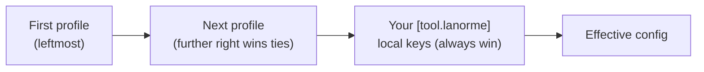

# Use configuration profiles

This how-to shows how to adopt the bundled profiles, compose several, point at a
local `.toml`, and read the merged result.

A profile is a named bundle of LaNorme settings you adopt with the `extends`
key, instead of copying the same toggles into every project. Use a profile to
turn on a coherent set of checks in one line, then override individual keys
locally where a project differs. For the full meaning of every key a profile can
set, see the [configuration reference](../reference/configuration.md).

## Adopt a single profile

Add `extends` to the `[tool.lanorme]` table in `pyproject.toml` (or to a
`lanorme.toml` / `.lanorme.toml` file):

```toml
[tool.lanorme]
extends = ["strict"]
```

`extends` takes one profile name or a list. A single name may also be given as
a bare string (`extends = "strict"`).

## The bundled profiles

Four profiles ship inside the package. One tightens severity, three configure
an architecture style.

| Profile | What it does |
| --- | --- |
| `strict` | Turns on every opt-in (default-off) generic check and sets `promote = ["ALL"]`, so all advisory warnings become build-failing errors. |
| `hexagonal` | Configures `layer_deps` for a four-layer ports-and-adapters backend and turns on `port_coverage`. |
| `clean` | Configures `layer_deps` for Clean Architecture's four layers (`entities`, `use_cases`, `interface_adapters`, `frameworks`). |
| `layered` | Configures `layer_deps` for classic N-tier layers (`presentation`, `business`, `persistence`). |

`strict` switches on the generic opt-in checks (`named_args`, `test_style`,
`attribute_access`, `restating`, `similarity`, `prose`) and promotes all
warnings. It does not turn on the architecture checks: `layer_deps` and
`port_coverage` stay off because `strict` carries no layout for them. Pick one
of `hexagonal`, `clean` or `layered` to enforce architecture, and compose it
with `strict` if you want both.

The architecture profiles are mutually exclusive in practice: each configures
`layer_deps` for a different layer layout, so extend exactly one of them.

## Compose several profiles

List more than one name to merge them. The common pairing is strict severity
plus an architecture style:

```toml
[tool.lanorme]
extends = ["strict", "hexagonal"]
```

This gives you every generic opt-in check, `promote = ["ALL"]`, the hexagonal
layer rules, and port coverage, all from two profile names.

## Extend a local `.toml`

An `extends` entry that ends in `.toml`, or contains a path separator, is read
as a file relative to the project root instead of a bundled name. Use this to
share one team standard across repositories:

```toml
[tool.lanorme]
extends = ["strict", "team-rules.toml"]
```

The file holds a bare `[tool.lanorme]`-style body (the keys directly, with no
wrapping table):

```toml
# team-rules.toml
promote = ["TYPE-004"]

[similarity]
enabled = true
```

An `extends` key inside a profile is ignored, so profiles do not chain.

## How merging works

Profiles merge left to right, then your own keys merge on top, so a local key
always wins. Tables merge per key: a local `[tool.lanorme.layer_deps]` that sets
only `transport_layers` overrides that one key and leaves the rest of the
profile's `layer_deps` table intact.



Order matters when two profiles set the same key. In `extends = ["strict",
"team-rules.toml"]` above, `team-rules.toml` is to the right of `strict`, so its
`promote = ["TYPE-004"]` replaces strict's `promote = ["ALL"]`. Put the profile
whose value should win further right, or set the key in your own
`[tool.lanorme]` table to beat every profile.

## Confirm the merged result

Run `check` with `--show-config` to print the discovered config and the
effective per-check settings, then exit without running any check. Given this
project config:

```toml
[tool.lanorme]
extends = ["strict", "hexagonal"]
ignore = ["NAMING-003"]

[tool.lanorme.prose]
enabled = false
```

the command reports the merged outcome:

```console
$ lanorme check src --show-config
config file:  /path/to/project/pyproject.toml [tool.lanorme]
project root: /path/to/project

[tool.lanorme]
  ignore = ['NAMING-003']
  promote = ['ALL']

checks (effective settings):
  ...
  layer_deps         source_root='' layers=<4 items> transport_layers=('api',) allowed_imports=<4 keys> composition_root=<4 items>
  ...
  port_coverage      source_root='' ports_dir='application/ports' adapter_roots=('infrastructure',) composition_root=<4 items> ...
  prose              enabled=False ...   (opt-in, not enabled)
  ...
```

Read it as the merge in action:

- `promote = ['ALL']` comes from `strict`.
- `layer_deps` and `port_coverage` are configured by `hexagonal`.
- `ignore` comes from the local table.
- `prose` is `enabled=False`: `strict` turns prose on, but the local
  `[tool.lanorme.prose]` table wins.

The `config file` and `project root` paths vary per machine.

> !!! note
>     An unknown profile name is a configuration error. `lanorme check`
>     prints the available bundled names and exits with code 2 (usage or
>     config error), the same exit code as malformed config.

## Override CLI flags still apply

Command-line flags override config, including anything a profile sets. To run a
single category once without editing the profile, pass `--select` or
`--ignore`:

```console
$ lanorme check src --ignore PORT
```

The `--promote` flag does the same for severity, so you can escalate or hold
back warnings for one run regardless of the profile's `promote` value.

## Related

- [Configuration reference](../reference/configuration.md) for every
  `[tool.lanorme]` key, including `extends`, `promote` and `baseline`.
- [Rule reference](../RULES.md) for what each check flags and the per-check
  settings a profile configures.

A profile sets policy, not adoption pace. To roll a strict profile onto an
existing codebase without drowning in pre-existing findings, pair it with a
baseline: record current findings with `lanorme baseline write`, set the
`baseline` key, and only new findings report. See the `baseline` entry in the
configuration reference.
