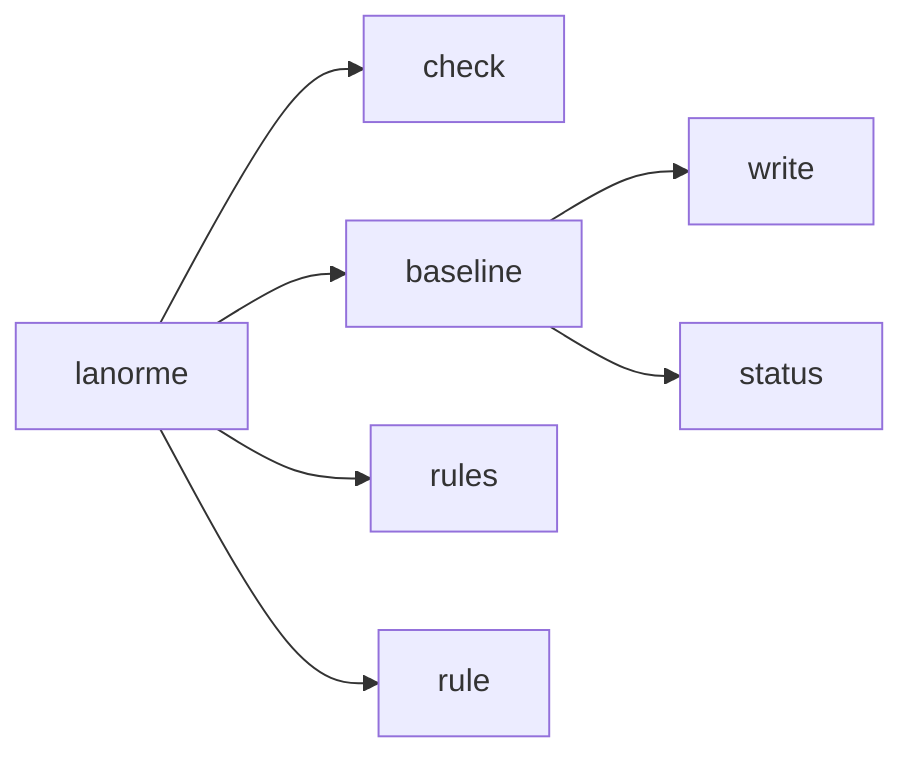

# CLI reference

This reference describes every `lanorme` command, subcommand, argument, and flag, together with the config-discovery order, output formats, and exit codes.

Every `lanorme` command, its arguments, and its flags. The descriptions
reflect `lanorme <command> --help` exactly. For the configuration keys that
the flags override, see the [configuration reference](configuration.md). For
what each rule catches, see the [rule reference](../RULES.md) and the
[rule index](rules-index.md).

## Synopsis

```text
lanorme [-h] [--version] {check,baseline,rules,rule} ...
```

| Option | Effect |
| --- | --- |
| `-h`, `--help` | Show help and exit. |
| `--version` | Print the program version and exit (for example `lanorme 0.12.0`). |

The four subcommands:

| Command | Purpose |
| --- | --- |
| [`check`](#check) | Run checks against one or more paths. |
| [`baseline`](#baseline) | Record or inspect the warning baseline. |
| [`rules`](#rules) | List all registered rules and exit. |
| [`rule`](#rule) | Print the reference section for a single rule code. |

Only `baseline` nests further, into `write` and `status`:



## Config discovery

A command that runs checks reads configuration from the first source found
walking up from the scan path:

1. `lanorme.toml` in the directory. Keys live at the **top level** of the
   file, with no table prefix.
2. `.lanorme.toml`, same top-level layout.
3. A `[tool.lanorme]` table in `pyproject.toml`.

```toml
# lanorme.toml: keys at the top level
select = ["SEC", "CMT-001"]
baseline = "lanorme-baseline.json"
```

```toml
# pyproject.toml: the same keys under [tool.lanorme]
[tool.lanorme]
select = ["SEC", "CMT-001"]
baseline = "lanorme-baseline.json"
```

CLI flags override the matching config key for that run. `--show-config`
prints the discovered source and the effective per-check settings.

## check

Run checks against one or more paths.

```text
lanorme check [-h] [--check SINGLE] [--select SELECT] [--ignore IGNORE]
              [--exclude EXCLUDE] [--promote PROMOTE] [--show-config]
              [--plugin PLUGIN]
              [--output-format {concise,full,json,ndjson,github}]
              [--json] [--no-baseline]
              [paths ...]
```

### Arguments

| Argument | Description |
| --- | --- |
| `paths` | Path(s) to check. Default: `.` (the current directory). |

### Flags

| Flag | Description |
| --- | --- |
| `--check SINGLE` | Run a single check by name (for example `duplication`), or by rule code or category (for example `DRY-001`, `SIZE`). |
| `--select SELECT` | Comma-separated rule codes or categories to run. Overrides config `select`. |
| `--ignore IGNORE` | Comma-separated rule codes or categories to skip. Overrides config `ignore`. |
| `--exclude EXCLUDE` | Comma-separated file-path globs to exclude. Overrides config `exclude`. |
| `--promote PROMOTE` | Comma-separated rule codes or categories whose warnings become build-failing errors, or `ALL`. Overrides config `promote`. |
| `--show-config` | Print the discovered config and effective per-check settings, then exit. |
| `--plugin PLUGIN` | Plugin module to load. Repeatable. Adds to config `plugins`. |
| `--output-format {concise,full,json,ndjson,github}` | Output format. Default: `concise`. See [output formats](#output-formats). |
| `--json` | Alias for `--output-format=json`. |
| `--no-baseline` | Ignore the configured baseline for this run and report the whole debt. |

A category name (such as `SEC`) covers every code in it; `ALL` covers every
code. The selection, ignore, exclude and promote keys are documented in the
[configuration reference](configuration.md); a CLI flag wins over its config
key for that run.

### Promotion

`--promote` escalates the named advisory warnings, or `ALL` warnings, to
build-failing errors. A run with only warnings exits `0`; promoting those
warnings turns them into violations and the run exits `1`.

```console
$ lanorme check --check SIZE-003 .
[WARN] file_limits
  VIOLATION: big.py:1 — Class 'C' has 11 methods (warn: 10)
--- file_limits: 0 violations, 1 warnings ---
Summary: 1 checks — 0 passed, 1 warnings, 0 failed.
$ echo $?
0
```

```console
$ lanorme check --check SIZE-003 --promote ALL .
[FAIL] file_limits
  VIOLATION: big.py:1 — Class 'C' has 11 methods (warn: 10)
--- file_limits: 1 violations, 0 warnings ---
Summary: 1 checks — 0 passed, 0 warnings, 1 failed.
$ echo $?
1
```

### Baseline interaction

When config sets `baseline`, `check` suppresses every recorded finding and
reports only new debt. `--no-baseline` ignores the baseline and reports the
whole debt. If `baseline` is set but the file does not exist, `check` exits
`2` and tells you to run `lanorme baseline write` first. The
`lanorme baseline` subcommand records and inspects that file.

## baseline

Record or inspect the warning baseline.

```text
lanorme baseline [-h] {write,status} [paths ...]
```

### Arguments

| Argument | Description |
| --- | --- |
| `{write,status}` | `write` records current findings; `status` lists stale entries. |
| `paths` | Project root to scan. Default: `.` |

`baseline` runs over the whole project root. Passing file targets or
selection flags is refused with exit `2`, because a narrowed write would
regenerate the baseline from a partial run and prune everything out of scope.

```console
$ lanorme baseline write a.py
ERROR: 'baseline' must run over the whole project root, without file targets or selection flags.
$ echo $?
2
```

The baseline file path comes from the `baseline` config key. When that key is
unset, the default path is `lanorme-baseline.json` at the project root.

### baseline write

Record the current findings into the baseline file. On the first write it
also prints the config block to adopt. Exits `0`.

```console
$ lanorme baseline write .
Wrote 1 baseline entry (1 finding): +1 new, -0 pruned (was 0).

Add this to your configuration and commit the file like a lockfile:

    [tool.lanorme]
    baseline = "lanorme-baseline.json"
```

Matching is content-anchored, not line-number-anchored, so a recorded entry
survives unrelated edits above it. Commit the file like a lockfile. With a
baseline in place, `check` holds the project to account only for findings it
adds.

### baseline status

List baseline entries that match nothing in the current run, the stale debt
to prune. Exits `0`.

```console
$ lanorme baseline status .
1 stale baseline entry (matched nothing this run):
  bad.py  CMT-001

Run 'lanorme baseline write' to prune them.
```

When nothing is stale:

```console
$ lanorme baseline status .
Baseline is current: all 1 entries still match a finding.
```

## rules

List all registered rules and exit.

```text
lanorme rules [-h]
```

Output groups every rule code under its check, in registry order. Opt-in
checks appear in the list but emit nothing until enabled.

```console
$ lanorme rules

## comments — Concise, clean comments (commented-out code, verbosity, style)
  CMT-001: No commented-out code
  CMT-002: No verbose comments (block or line too long)
  PROSE-001: No em dashes in comments or docstrings (opt-in)
  PROSE-003: No emoji in comments or docstrings (opt-in)
```

The same data, with the opt-in column, is in the
[rule index](rules-index.md). Exits `0`.

## rule

Print the reference section for a single rule code.

```text
lanorme rule [-h] code
```

### Arguments

| Argument | Description |
| --- | --- |
| `code` | The rule code to look up (for example `CMT-001`, `SQL-001`). |

```console
$ lanorme rule CMT-001
### `CMT-001`: No commented-out code

Default-on. Walks every `#` comment and parses its text as Python; if the
result is one of `_CODE_NODES` (imports, assigns, defs, control flow,
returns / raises / asserts, ...), the comment is treated as disabled code.
```

An unknown code prints a not-found notice and exits `2`:

```console
$ lanorme rule NOPE-999
No reference section found for 'NOPE-999'. Run 'lanorme rules' for the list of emitted codes, or browse docs/RULES.md directly.
```

## Output formats

`check` accepts five formats via `--output-format`.

| Format | Shape |
| --- | --- |
| `concise` | Default. Only checks with findings, plus a one-line summary. |
| `full` | Every check, including those that passed. |
| `json` | One JSON object per check (a single array). `--json` is the alias. |
| `ndjson` | One finding per line, as JSON. |
| `github` | GitHub Actions workflow commands. Auto-selected when `GITHUB_ACTIONS=true`. |

`concise` reports only checks with findings and ends with a summary:

```console
$ lanorme check bad.py
[FAIL] comments
  VIOLATION: bad.py:2 — Commented-out code: x = 2
    Rule: CMT-001
    Fix: Delete it; version control remembers
--- comments: 1 violations, 0 warnings ---

Summary: 25 checks — 24 passed, 0 warnings, 1 failed.
```

`json` emits one object per check, with `violations` and `warnings` arrays:

```console
$ lanorme check --json bad.py
[
  {
    "check": "comments",
    "status": "FAIL",
    "violations": [
      {
        "file": "bad.py",
        "line": 2,
        "code": "CMT-001",
        "rule": "CMT-001",
        "message": "Commented-out code: x = 2",
        "fix": "Delete it; version control remembers"
      }
    ],
```

`ndjson` emits one finding per line, each carrying its `check` and `severity`:

```console
$ lanorme check --output-format ndjson bad.py
{"check": "comments", "severity": "error", "file": "bad.py", "line": 2, "code": "CMT-001", "rule": "CMT-001", "message": "Commented-out code: x = 2", "fix": "Delete it; version control remembers"}
```

`github` emits workflow commands that annotate the diff in a GitHub Actions
run. It is selected automatically when `GITHUB_ACTIONS=true`:

```console
$ lanorme check --output-format github bad.py
::error file=bad.py,line=2,title=CMT-001::Commented-out code: x = 2
```

## Exit codes

| Code | Meaning |
| --- | --- |
| `0` | Clean run. No violations (warnings alone, or a baseline-suppressed run, still exit `0`). |
| `1` | Violations found. |
| `2` | Usage or configuration error. |

Exit `2` covers an unknown subcommand, an invalid flag value (such as a bad
`--output-format` choice), a nonexistent scan path, a `baseline` write or
status given file targets, a configured baseline file that does not exist,
and `lanorme rule <CODE>` with an unknown code.

>!!! note
>    `lanorme rule <CODE>` with an unknown code exits `2`. The lookup found
>    nothing, so it is reported as a not-found error rather than a clean run.
