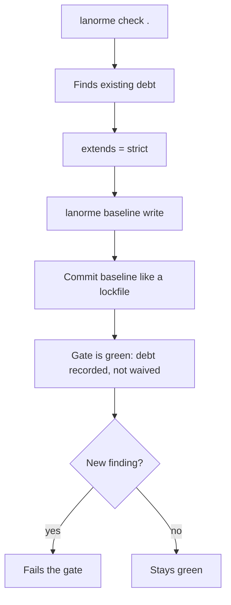

# Adopt LaNorme on an existing codebase

This tutorial takes a real, messy project to a green strict gate by learning
through doing. You will run LaNorme, see it find genuine problems, record the
existing debt as a baseline, and end with a build that passes while still
holding every new line to the strict profile.

The payoff: from the first commit, only new code has to meet the standard. The
debt you started with stays recorded and quiet until you choose to pay it down.

You will need Python 3.13 or newer and a terminal. The whole tutorial fits in
two effective commands: one baseline, one check.

The shape of the adoption flow:



## What you will build

A small project with three findings already in it. By the end:

- `[tool.lanorme]` extends the `strict` profile.
- A committed `lanorme-baseline.json` records the starting debt.
- `lanorme check .` exits clean.
- A freshly introduced violation reports, while the recorded debt stays silent.

## Step 1: install

Install LaNorme into the environment you run checks from.

```bash
pip install lanorme
```

Confirm the command resolves:

```bash
lanorme --version
```

```text
lanorme 0.12.0
```

## Step 2: create a project to work on

So the steps are reproducible, build a throwaway project rather than pointing at
your own repository on the first read. Everything below happens inside one
scratch directory.

```bash
cd "$(mktemp -d)"
mkdir myapp
```

Write a module with a few ordinary problems in it: a leftover commented-out
line and a function that takes too many positional parameters.

```python
# myapp/users.py
import os


def get_user(id):
    # old = lookup(id)
    return {"id": id}


def fetch_user(id):
    return {"id": id}


def process(a, b, c, d, e, f):
    if a:
        if b:
            if c:
                if d:
                    return a + b + c + d + e + f
    return None
```

Add a minimal `pyproject.toml` so the project has a config home:

```toml
# pyproject.toml
[project]
name = "myapp"
version = "0.1.0"
```

## Step 3: run the first check

Run LaNorme against the project. Expect findings; that is the point.

```bash
lanorme check .
```

```text
[FAIL] comments
  VIOLATION: myapp/users.py:5 — Commented-out code: old = lookup(id)
    Rule: CMT-001
    Fix: Delete it; version control remembers
--- comments: 1 violations, 0 warnings ---

[WARN] file_limits
  VIOLATION: myapp/users.py:13 — Function 'process' has parameter count 6 (warn: 5)
    Rule: PARAM-001: Function approaching 8 parameters
    Fix: Consider grouping related parameters into a dataclass or TypedDict
--- file_limits: 0 violations, 1 warnings ---

Summary: 25 checks — 23 passed, 1 warnings, 1 failed.
```

The exit code is `1` because at least one finding was reported. The default
`concise` format shows only checks that found something, plus a summary. Other
formats (`full`, `json`, `ndjson`, `github`) are available through
`--output-format`; see the [configuration reference](../reference/configuration.md).

>!!! note
>    Exit codes are stable: `0` clean, `1` findings, `2` a usage or config
>    error. A CI step can branch on them directly.

## Step 4: turn on the strict profile

`extends` adopts a bundled profile. The `strict` profile enables the opt-in
checks and escalates advisory warnings to build-failing errors, so the gate is
as demanding as it gets from day one. Add it to `[tool.lanorme]`:

```toml
# pyproject.toml
[project]
name = "myapp"
version = "0.1.0"

[tool.lanorme]
extends = ["strict"]
```

Run the check again:

```bash
lanorme check .
```

```text
[FAIL] comments
  VIOLATION: myapp/users.py:5 — Commented-out code: old = lookup(id)
    Rule: CMT-001
    Fix: Delete it; version control remembers
--- comments: 1 violations, 0 warnings ---

[FAIL] file_limits
  VIOLATION: myapp/users.py:13 — Function 'process' has parameter count 6 (warn: 5)
    Rule: PARAM-001: Function approaching 8 parameters
    Fix: Consider grouping related parameters into a dataclass or TypedDict
--- file_limits: 1 violations, 0 warnings ---

[FAIL] named_args
  VIOLATION: myapp/users.py:13 — Function 'process' has 6 positional params without bare *
    Rule: KWARG-001: Functions with >1 parameter must use bare * separator
    Fix: Add a bare * separator: def foo(self, *, param1: str, param2: int)
--- named_args: 1 violations, 0 warnings ---

Summary: 25 checks — 22 passed, 0 warnings, 3 failed.
```

Three failures now. The `PARAM-001` warning has become an error, and the opt-in
`KWARG-001` check has switched on and found the same function. On a real
codebase the count is usually larger. Fixing every one before you can merge is
the wall most teams hit, and the reason adoption stalls. The baseline is the way
through it.

Bundled profiles are `strict`, `hexagonal`, `clean`, and `layered`. You can also
point `extends` at a path to a local `.toml`. They merge left to right, and your
own keys merge on top, so local settings always win. See
[`extends`](../reference/configuration.md#extends).

## Step 5: record the debt as a baseline

`lanorme baseline write` scans the project and records every current finding to
a file. Anything in that file is suppressed on later runs, so only findings that
are not already recorded report.

```bash
lanorme baseline write
```

```text
Wrote 3 baseline entries (3 findings): +3 new, -0 pruned (was 0).

Add this to your configuration and commit the file like a lockfile:

    [tool.lanorme]
    baseline = "lanorme-baseline.json"
```

The command writes `lanorme-baseline.json` and prints the exact config block to
add. The file is a plain JSON list of entries, one per recorded finding, each
anchored to the code and a hash of its context rather than a line number, so it
survives unrelated edits above it.

## Step 6: point the config at the baseline

Add the printed key so checks read the baseline:

```toml
# pyproject.toml
[project]
name = "myapp"
version = "0.1.0"

[tool.lanorme]
extends = ["strict"]
baseline = "lanorme-baseline.json"
```

## Step 7: commit the baseline like a lockfile

Commit `lanorme-baseline.json` alongside the config change. It is a shared,
reviewable record of the debt every contributor inherits, the same way a lock
file pins dependencies. Keep it in version control and review changes to it.

```bash
git add pyproject.toml lanorme-baseline.json
git commit -m "Adopt LaNorme strict profile with a debt baseline"
```

## Step 8: confirm the gate is green

Run the check once more. The recorded findings are suppressed, so the project
passes:

```bash
lanorme check .
```

```text
All 25 checks passed.
```

```text
Exit code: 0
```

The gate is green and strict at the same time. The starting debt did not move;
it is recorded, not waived.

## Step 9: see a new violation report

The point of the baseline is that new problems still fail the gate. Add a second
module with a fresh commented-out line:

```python
# myapp/orders.py
def place_order(cart):
    # total = compute(cart)
    return {"ok": True}
```

```bash
lanorme check .
```

```text
[FAIL] comments
  VIOLATION: myapp/orders.py:2 — Commented-out code: total = compute(cart)
    Rule: CMT-001
    Fix: Delete it; version control remembers
--- comments: 1 violations, 0 warnings ---

Summary: 25 checks — 24 passed, 0 warnings, 1 failed.
```

Only the new finding in `myapp/orders.py` reports. The recorded debt in
`myapp/users.py` stays quiet. New code is held to the full strict profile; old
code is not blocking the build. Delete the commented-out line and the check goes
green again.

## Step 10: inspect the whole debt and stale entries

Two commands keep the baseline honest.

To see everything the baseline is suppressing, including the recorded debt, run
a check that ignores the baseline for that run:

```bash
lanorme check --no-baseline .
```

```text
[FAIL] comments
  VIOLATION: myapp/orders.py:2 — Commented-out code: total = compute(cart)
    Rule: CMT-001
    Fix: Delete it; version control remembers
  VIOLATION: myapp/users.py:5 — Commented-out code: old = lookup(id)
    Rule: CMT-001
    Fix: Delete it; version control remembers
--- comments: 2 violations, 0 warnings ---

[FAIL] file_limits
  VIOLATION: myapp/users.py:13 — Function 'process' has parameter count 6 (warn: 5)
    Rule: PARAM-001: Function approaching 8 parameters
    Fix: Consider grouping related parameters into a dataclass or TypedDict
--- file_limits: 1 violations, 0 warnings ---

[FAIL] named_args
  VIOLATION: myapp/users.py:13 — Function 'process' has 6 positional params without bare *
    Rule: KWARG-001: Functions with >1 parameter must use bare * separator
    Fix: Add a bare * separator: def foo(self, *, param1: str, param2: int)
--- named_args: 1 violations, 0 warnings ---

Summary: 25 checks — 22 passed, 0 warnings, 3 failed.
```

That is the full picture: the new finding plus the three recorded ones. It is
your backlog whenever you want to chip away at the debt.

As you pay debt down, recorded entries that no longer match anything become
stale. `lanorme baseline status` lists them. Pay one item down first by removing
the commented-out line in `myapp/users.py`, then ask for status:

```bash
lanorme baseline status
```

```text
1 stale baseline entry (matched nothing this run):
  myapp/users.py  CMT-001

Run 'lanorme baseline write' to prune them.
```

`status` never edits the file; it only reports. When you are happy to lock in the
progress, run `lanorme baseline write` again to prune the stale entries and
record the smaller debt. Over time the baseline shrinks toward empty, and the
strict gate covers the whole codebase.

## What you learned

- `extends = ["strict"]` turns on the full profile, opt-in checks and all.
- `lanorme baseline write` records the existing debt and prints the config block
  to add.
- `baseline = "lanorme-baseline.json"`, committed like a lock file, suppresses
  that debt so the gate passes.
- New violations still report; recorded debt stays quiet until you pay it down.
- `lanorme check --no-baseline` shows the whole debt; `lanorme baseline status`
  lists stale entries ready to prune.

From here, every pull request is held to the strict profile on its new code,
with no upfront cleanup required.

## Next steps

- [Configuration reference](../reference/configuration.md): every
  `[tool.lanorme]` key, including `promote`, `per-file-ignores`, and `source_root`.
- [Rule reference](../RULES.md): what each check enforces and how to configure it.
- `lanorme rules` lists every registered rule; `lanorme rule <CODE>` prints the
  reference section for one code.
