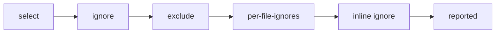

# Configure which checks run

This how-to gives recipes for narrowing what LaNorme runs and silencing the
noise you have decided to accept, from selecting a subset of rules down to
silencing a single line. Each recipe gives the goal, the `[tool.lanorme]`
config, the equivalent command-line flag where one exists, and a verified
example.

A finding has to survive every stage below to be reported, applied in this
order:



Config is read from `[tool.lanorme]` in `pyproject.toml`, or from a
`lanorme.toml` / `.lanorme.toml` file. LaNorme walks up from the scan path to
the outermost config, and a nested config cascades over the ones above it; see
[config discovery](../reference/cli.md#config-discovery). Command-line flags
override config for a single run. For the full key list and types, see the
[configuration reference](../reference/configuration.md). Rule codes and
categories are listed by `lanorme rules`; per-check settings live in the
[rule reference](../RULES.md).

!!! note
    The recipes below use the `pyproject.toml` layout. In a standalone
    `lanorme.toml` / `.lanorme.toml` the `tool.lanorme` prefix is dropped:
    top-level scalar keys go bare (`select = [...]`) and sub-tables lose the
    prefix too, so `[tool.lanorme.per-file-ignores]` becomes
    `[per-file-ignores]`. A prefixed header in a `lanorme.toml` is a
    configuration error (exit `2`), as is any top-level key that is neither a
    run key nor the name of a check. See the
    [config discovery](../reference/cli.md#config-discovery) note in the CLI
    reference.

Targets are rule codes (`EVAL-001`), categories (the part before the dash:
`CMT`, `SECRETPY`), or `ALL`. `lanorme rules` lists every code. A target that
names no known code or category, in a flag, in `[tool.lanorme]` or in
`per-file-ignores`, is a usage error: the run exits `2` and points you at
`lanorme rules`.

```console
$ lanorme check src --select EVAL-01
ERROR: 'select' names no known rule code or category: 'EVAL-01'.
  Run 'lanorme rules' to list every code and category.
$ echo $?
2
```

## Run only some checks

Goal: run a chosen subset and skip everything else.

```toml
[tool.lanorme]
select = ["SECRETPY", "EVAL-001"]
```

Equivalent flag: `--select` takes a comma-separated list.

```console
$ lanorme check src --select EVAL-001
[FAIL] security_calls
  VIOLATION: pkg/main.py:1 — eval() on a non-literal argument is an RCE primitive
    Rule: EVAL-001: No eval/exec/compile on a non-literal argument
    Fix: Use ast.literal_eval for trusted-shape parsing, or build a dispatch table
--- security_calls: 1 violations, 0 warnings ---

Summary: 30 checks — 29 passed, 0 warned, 1 failed.
Findings: 1 error to fix, 0 advisory warnings.
Opt-in checks not enabled: 11 ('lanorme check --show-config' lists them).
```

A category selects every code under it: `--select CMT` runs every comment
rule; `--select ALL` runs everything enabled. `--select` takes codes and
categories, not check names. To run one check by name, use `--check`
(`--check file_limits`).

!!! note
    Opt-in checks stay off even when named in `select`. Enable them first
    with `[tool.lanorme.<check>] enabled = true` (for example
    `[tool.lanorme.prose]`). See the [rule reference](../RULES.md).

## Skip a rule everywhere

Goal: keep the full run but drop one rule (or one category) you do not want.

```toml
[tool.lanorme]
ignore = ["PARAM-001"]
```

Equivalent flag: `--ignore` takes a comma-separated list. Here the
`file_limits` check finds a nine-parameter function:

```console
$ lanorme check src --check file_limits
[FAIL] file_limits
  VIOLATION: pkg/wide.py:1 — Function 'build' has parameter count 9 (limit: 8)
    Rule: PARAM-001: Function exceeds the parameter limit
    Fix: Group related parameters into a dataclass or TypedDict
--- file_limits: 1 violations, 0 warnings ---

Summary: 1 checks — 0 passed, 0 warned, 1 failed.
Findings: 1 error to fix, 0 advisory warnings.
```

Ignoring `PARAM-001` drops it and keeps the rest of the check:

```console
$ lanorme check src --check file_limits --ignore PARAM-001
All 1 checks passed.
```

`--select SIZE,COMPLEXITY` narrows a full run to the size and complexity
codes the same way, leaving `PARAM` out.

`ignore` applies after `select`, so a rule that is both selected and ignored
is skipped.

## Exclude paths from the scan

Goal: never walk certain files, such as generated code or migrations.

```toml
[tool.lanorme]
exclude = ["**/migrations/*", "generated/*"]
```

Equivalent flag: `--exclude` takes a comma-separated list of globs.

Globs match the path relative to the project root. A leading `**/` matches a
directory at any depth, so `**/migrations/*` excludes `src/pkg/migrations/`:

```console
$ lanorme check . --select EVAL-001
[FAIL] security_calls
  VIOLATION: src/pkg/main.py:1 — eval() on a non-literal argument is an RCE primitive
    Rule: EVAL-001: No eval/exec/compile on a non-literal argument
    Fix: Use ast.literal_eval for trusted-shape parsing, or build a dispatch table
  VIOLATION: src/pkg/migrations/m.py:1 — eval() on a non-literal argument is an RCE primitive
    Rule: EVAL-001: No eval/exec/compile on a non-literal argument
    Fix: Use ast.literal_eval for trusted-shape parsing, or build a dispatch table
--- security_calls: 2 violations, 0 warnings ---

Summary: 30 checks — 29 passed, 0 warned, 1 failed.
Findings: 2 errors to fix, 0 advisory warnings.
Opt-in checks not enabled: 11 ('lanorme check --show-config' lists them).

$ lanorme check . --select EVAL-001 --exclude '**/migrations/*'
[FAIL] security_calls
  VIOLATION: src/pkg/main.py:1 — eval() on a non-literal argument is an RCE primitive
    Rule: EVAL-001: No eval/exec/compile on a non-literal argument
    Fix: Use ast.literal_eval for trusted-shape parsing, or build a dispatch table
--- security_calls: 1 violations, 0 warnings ---

Summary: 30 checks — 29 passed, 0 warned, 1 failed.
Findings: 1 error to fix, 0 advisory warnings.
Opt-in checks not enabled: 11 ('lanorme check --show-config' lists them).
```

Match the depth you have. To exclude a `migrations/` directory sitting at the
project root, use `migrations/*`; the leading `**/` form needs a parent
segment and will not match a top-level directory.

Naming an excluded path on the command line does not override the glob. With
`exclude = ["**/migrations/*"]` in config, asking for the excluded file checks
nothing: the run reports a clean tree and a note on stderr says so.

```console
$ lanorme check src/pkg/migrations/m.py --select EVAL-001
Note: every requested path matches an exclude glob, so nothing was checked. Pass --exclude with another glob to override the configured excludes for one run.
All 30 checks passed.
Opt-in checks not enabled: 11 ('lanorme check --show-config' lists them).
```

## Silence a rule for a path glob

Goal: keep a rule on, but accept it for files matching a glob (for example,
allow wide-signature test factories under `tests/` to keep `PARAM-001`).

This is config only; there is no command-line equivalent.

Without any suppression, a nine-parameter factory in `tests/factories.py`
reports `PARAM-001`:

```console
$ lanorme check . --select PARAM-001
[FAIL] file_limits
  VIOLATION: tests/factories.py:1 — Function 'build' has parameter count 9 (limit: 8)
    Rule: PARAM-001: Function exceeds the parameter limit
    Fix: Group related parameters into a dataclass or TypedDict
--- file_limits: 1 violations, 0 warnings ---

Summary: 30 checks — 29 passed, 0 warned, 1 failed.
Findings: 1 error to fix, 0 advisory warnings.
Opt-in checks not enabled: 11 ('lanorme check --show-config' lists them).
```

The key is a glob; the value is a list of codes or categories suppressed for
matching files. In `pyproject.toml` the table carries the `tool.lanorme`
prefix:

```toml
[tool.lanorme.per-file-ignores]
"tests/*" = ["PARAM-001"]
```

In a standalone `lanorme.toml` / `.lanorme.toml` the prefix is dropped and the
header is bare. The prefixed form is silently ignored there:

```toml
[per-file-ignores]
"tests/*" = ["PARAM-001"]
```

With either form in place, the matching file is no longer reported, and the
summary counts what the glob suppressed:

```console
$ lanorme check . --select PARAM-001
All 30 checks passed.
Suppressed: 0 by inline ignores, 1 by per-file-ignores, 0 by the baseline.
Opt-in checks not enabled: 11 ('lanorme check --show-config' lists them).
```

Globs match paths relative to the project root, and so does a nested region:
a `tests/lanorme.toml` does not change what `"tests/*"` matches.

Confirm the discovered config and effective per-check settings with
`lanorme check --show-config`.

## Silence one line

Goal: accept a single finding in place, at the source line.

This is a source pragma; there is no command-line equivalent. Two directives
are read, both on the finding's own line:

- `# noqa` suppresses every finding on that line.
- `# noqa: CODE` suppresses only that rule code on that line; other findings
  on the line still report, and a different code does not suppress.
- `# lanorme: ignore` and `# lanorme: ignore[CODE, CODE]` behave the same way,
  bare or with a bracketed code list.

`# noqa` is shared with ruff and other linters, so a bare `# noqa` you add for
ruff also silences LaNorme on that line. Reach for `# lanorme: ignore[...]`
when you run both tools and want to silence a LaNorme finding alone: ruff
cannot parse the hyphen in a code like `TYPE-001`, so a shared `# noqa:
TYPE-001` makes ruff report an invalid directive, while `# lanorme: ignore`
carries no `noqa` token for ruff to read.

A code in either directive may be an exact code (`EVAL-001`), a category
(`CMT`), or `ALL`, matching the other config targets. A finding reported at
line `0` is about the whole file (a junk-drawer module, say) and has no line
to carry a directive; silence it with `per-file-ignores` instead.

Given this file checked with `--select EVAL-001`:

```python
def f():
    x = eval(input())


def g():
    y = eval(input())  # noqa


def h():
    z = eval(input())  # noqa: EVAL-001


def k():
    w = eval(input())  # lanorme: ignore[EVAL-001]


def m():
    v = eval(input())  # noqa: SQL-001
```

Only lines 2 and 18 are reported. The bare `# noqa`, the matching
`# noqa: EVAL-001` and `# lanorme: ignore[EVAL-001]` suppress their lines.
`# noqa: SQL-001` names the wrong code and does not silence the `eval`.

```console
$ lanorme check a.py --select EVAL-001
[FAIL] security_calls
  VIOLATION: a.py:2 — eval() on a non-literal argument is an RCE primitive
    Rule: EVAL-001: No eval/exec/compile on a non-literal argument
    Fix: Use ast.literal_eval for trusted-shape parsing, or build a dispatch table
  VIOLATION: a.py:18 — eval() on a non-literal argument is an RCE primitive
    Rule: EVAL-001: No eval/exec/compile on a non-literal argument
    Fix: Use ast.literal_eval for trusted-shape parsing, or build a dispatch table
--- security_calls: 2 violations, 0 warnings ---

Summary: 30 checks — 29 passed, 0 warned, 1 failed.
Findings: 2 errors to fix, 0 advisory warnings.
Suppressed: 3 by inline ignores, 0 by per-file-ignores, 0 by the baseline.
Opt-in checks not enabled: 11 ('lanorme check --show-config' lists them).
```

## Tune a check's settings

Goal: change a check's threshold or option, such as the parameter limit.

Each check reads its own table, named after the check. The keys it accepts
are in its [rule reference](../RULES.md) section.

```toml
[tool.lanorme.file_limits]
param_error = 10
```

With the limit raised to 10, the nine-parameter factory drops from an error to
an advisory warning (it is still past the warning threshold of 5), and the run
exits `0`.

Every table is validated before the run. A value of the wrong type exits `2`
and names the table and the key. That covers a quoted number, a bare string
where a list is expected, and a float or `true` where an integer is expected:

```console
$ cat pyproject.toml
[tool.lanorme.file_limits]
param_error = "10"
$ lanorme check . --select PARAM-001
ERROR: invalid value for [tool.lanorme.file_limits] param_error: 'param_error' must be an integer, got str
  Run 'lanorme check . --show-config' to see the effective settings for every check.
```

A key the check does not read also exits `2`, and the message lists the keys
it does read:

```console
$ cat pyproject.toml
[tool.lanorme.file_limits]
param_limit = 10
$ lanorme check . --select PARAM-001
ERROR: unknown key in [tool.lanorme.file_limits]: 'param_limit'.
  Keys this check reads: class_method_warn, complexity_error, complexity_warn, file_error_lines, file_warn_lines, func_error_lines, func_warn_lines, param_error, param_warn.
```

The top level is strict in the same way: a key that is neither a run key
(`select`, `promote`, `source_root`, ...) nor the name of a check exits `2`
and lists both, and a `[tool.lanorme]` table inside a `lanorme.toml` is
refused with a message saying the keys go top level there. See
[config discovery](../reference/cli.md#config-discovery).

`lanorme check --show-config` prints each check's effective settings and,
on a `keys:` line under it, the keys its table accepts:

```console
$ lanorme check . --show-config
...
  file_limits        file_warn_lines=300 file_error_lines=500 func_warn_lines=50 func_error_lines=80 class_method_warn=10 complexity_warn=10 complexity_error=15 param_warn=5 param_error=10
                     keys: class_method_warn, complexity_error, complexity_warn, file_error_lines, file_warn_lines, func_error_lines, func_warn_lines, param_error, param_warn
...
```

## Exit codes

`lanorme check` exits `0` when clean or when only warnings were found, `1`
when there are violations, and `2` on a usage or config error. This drives
CI: a silenced finding leaves the run clean.

```console
$ lanorme check src --select EVAL-001   # no eval in src
All 30 checks passed.
Opt-in checks not enabled: 11 ('lanorme check --show-config' lists them).
$ echo $?
0
```

## See also

- [Configuration reference](../reference/configuration.md) for every
  `[tool.lanorme]` key, including `promote`, `extends`, `baseline`,
  `source_root`, and `plugins`.
- [Rule reference](../RULES.md) for what each code catches and its per-check
  settings.
