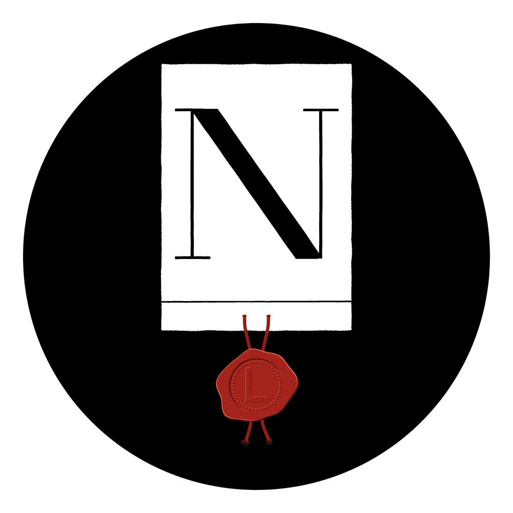

# LaNorme: the mark



A sealed charter, cut from a disc of ink. On the sheet is **N**, for _norme_, in the
manner of Didot: two hairline stems, one heavy shade, flat hairline serifs. From the fold
at its foot hangs a seal of red wax on silk laces, and the seal is pressed with a
**norma**, the carpenter's square that gave Latin, and then French, its word for a rule.
The square also reads as an **L**: with the N above it, _La Norme_. A written standard,
sealed so it holds.

It is a sibling of the [omamori lab](https://github.com/omamori-lab) mark and is built the
same way: a disc of ink, a white object cut from it, one letter written by a simulated
hand, and a small coloured seal. Where the omamori is Japanese (a charm, a bristle brush on
washi, a carved vermilion seal), this one is French (a charter, a pointed pen on laid
paper, a wax seal). Everything is painted by code, not set in a font and not drawn by an
image model.

## What is here

| Path | What it is |
|---|---|
| `painter/plume.html` | The painter. Open it in a browser and it paints the mark on a 4096 px canvas. |
| `build.py` | Paints every variant in headless Chrome and builds the files in `assets/`. |
| `assets/` | The finished files (see below). |

## The files

| File | Use |
|---|---|
| `assets/lanorme-github.png`, `-github-500.png` | The GitHub organisation avatar: a full-bleed black square, since GitHub crops organisations to a rounded square. It uses the small optical size, as it is mostly seen at 20 to 40 px. |
| `assets/lanorme.png`, `-2048.png`, `-master-4096.png` | The disc, on white. |
| `assets/lanorme-transparent.png`, `assets/lanorme.svg` | The disc, transparent outside it, for documentation sites and round frames. |
| `assets/lanorme-black-and-white.png` | Without the seal and its laces. |
| `assets/favicon/` | The small optical size in black and white, with transparent corners, at 16, 32, 48 and 180 px. The docs site uses the 180 px one as its logo and the 48 px one as its favicon. |
| `assets/seal-close-up.png` | The seal at full resolution. |

## Build it again

Needs Chrome or Chromium, ImageMagick 6 or 7, and potrace; the script uses only the Python
standard library.

```console
brew install imagemagick potrace          # or: apt-get install imagemagick potrace
python3 brand/build.py                    # red wax
python3 brand/build.py --wax green        # or the chancery's green
CHROME=/path/to/chrome python3 brand/build.py
```

The painting is deterministic: every ink thread, paper fibre and wax bubble comes from a
seeded random generator, so the same code paints the same sheet, pixel for pixel. The
painter also takes its options as a query string: `?wax=red` or `?wax=green` adds the
seal, `?optical=small` selects the small optical size, and `?clear=1` makes the outside of
the disc transparent.

## How it is painted

- **The pen.** A pointed nib is two tines. Pressing spreads them and the ink runs between;
  a light stroke is the width of the tines alone. So the N has a pressed shade on its
  diagonal and hairlines everywhere else, the contrast of the Didone faces. The ink is
  carried by threads between the tines. The edge threads ride the tines and stay wet
  longest, so a shade that runs short of ink opens down its middle first: railroading,
  the pointed pen's own trace, as dry-brush streaks are the brush's.
- **The letter.** N is written in its strokes: the left stem, the shade, the right stem,
  then the three serifs. The shade's outer edges meet the stems' outer edges, the left at
  the cap line and the right at the foot, where it is cut to a sharp vertex. Each serif is
  lifted with a small bead of ink, where the nib leaves the paper.
- **Optical sizes.** Didot cut every size of a face separately, with heavier hairlines in
  the small sizes. The mark does the same: the display size has hairlines about one eighth
  the weight of the shade; the small size, for the avatar and the favicons, about a third,
  so the N survives at 16 px.
- **The paper.** Laid paper keeps the marks of its mould: close laid lines from the wires
  and wider chain lines from the rods that held them. Each pixel's ink is compared with
  the height of that texture, so thin ink only catches the paper where it stands high. The
  sheet's own edge is the deckle, soft and a little uneven.
- **The fold.** The foot of a charter is turned up into a fold (_le repli_), and the laces
  of a hanging seal pass through slits cut in it.
- **The seal.** A cake of wax, poured a little unevenly, with the laces sunk in it and
  their ends left to fray below. The matrix left a round hollow with a beaded border
  (_grènetis_) and the norma standing in relief, graduated along its edges. It is flat in
  three tones, lit from the upper left: the wax, its shadow and its light.

## Why these choices

- **N in the manner of Didot.** The Didot family of Paris gave printing its first
  standard measure, the Didot point, and Firmin Didot cut the face that defines the French
  Modern style. A typographic standard for a code standard.
- **The norma.** Latin _norma_ is a carpenter's square; the sense of a rule or standard
  came from it, and French _norme_ from that. Something _normalis_ was made by the square.
- **Red wax.** It keeps the family's accent: the omamori seal is vermilion. The French
  royal chancery sealed its acts meant to last in green wax on silk laces, so green is kept
  as a variant (`--wax green`) for that reading.
- **A hanging seal rather than a printed one.** A seal on laces through the fold is the
  form of a solemn act: the standard is not only written, it is authenticated.

## Still open

- **Independent review.** The omamori mark was judged by a seal carver, a calligraphy
  teacher, a reader of the culture and a brand designer before it shipped. This one has
  had no such review yet; a lettering designer for the N, and a French reader for the
  charter and the seal, would be the first to ask.
- **The fold at small sizes.** Below about 64 px the fold's hairline disappears and the
  sheet reads as a plain card. That is acceptable, but worth watching.

## Sources

- The Didot point and the Didot family: [Point (typography)](https://en.wikipedia.org/wiki/Point_(typography)), [Didot family](https://en.wikipedia.org/wiki/Didot_family).
- _Norm_ from Latin _norma_, a carpenter's square: [Etymonline](https://www.etymonline.com/word/norm), [Wiktionary](https://en.wiktionary.org/wiki/norma).
- Royal acts sealed in green wax for lasting effect, and pendant seals on silk laces through the fold: [Universalis, ordonnances royales](https://www.universalis.fr/encyclopedie/ordonnances-royales/), [Historical Dictionary of Switzerland, sceau](https://hls-dhs-dss.ch/fr/articles/012808).
- The construction, the build and the painting method follow the omamori lab mark.

No licence has been chosen for the mark yet, so all rights are reserved.
