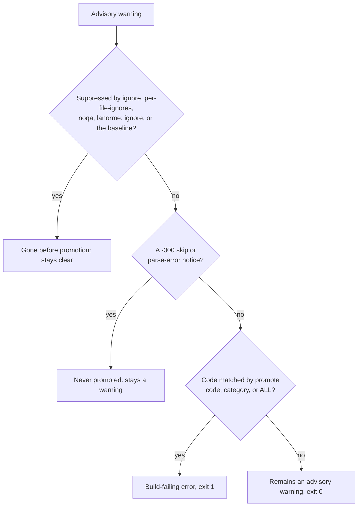

# Promote advisory warnings to build-failing errors

This how-to shows how to turn an advisory warning into a build-failing error with `promote`, and explains how promotion interacts with suppression, skip notices, and the `strict` profile.

The decision a single warning runs through is:



Some rules report at the advisory tier: they raise a warning, but the run
still exits `0`. `TYPE-004` (a function with typed parameters and a real
return value should declare a return type) is one such rule. When you want
an advisory rule to break the build instead, promote it: the run then exits
`1` like any other finding.

## A. Promote a single rule

Add the rule code to `promote` in `[tool.lanorme]`:

```toml
[tool.lanorme]
promote = ["TYPE-004"]
```

This is the `pyproject.toml` form. In a standalone `lanorme.toml` the prefix is
dropped, so write `promote = ["TYPE-004"]` at the top level with no
`[tool.lanorme]` header (a `[tool.lanorme]` table there is a configuration
error and the run exits `2`).
See the [configuration reference](../reference/configuration.md) for the header
convention.

A category works too (`promote = ["TYPE"]`), as does the whole catalogue:

```toml
[tool.lanorme]
promote = ["ALL"]
```

The same applies on the command line, where `--promote` takes a
comma-separated list of codes, categories, or `ALL`. A command-line flag
overrides the config value for that run.

```bash
lanorme check src --promote TYPE-004
lanorme check src --promote ALL
```

## B. Before and after

Start with a function that has typed parameters but no return annotation:

```python
def total_price(quantity: int, unit_price: float):
    return quantity * unit_price
```

Without promotion, `TYPE-004` reports as a warning and the run still passes:

```console
$ lanorme check orders.py --select TYPE-004
[WARN] strong_types
  WARNING: orders.py:1 — 'total_price' has annotated parameters and returns a value but no return annotation. Declare the return type so the signature is complete.
    Rule: TYPE-004: A function with annotated parameters that returns a value should declare a return type (advisory warning)
    Fix: Add a return annotation (for example '-> ResultType') to the signature
--- strong_types: 0 violations, 1 warnings ---

Summary: 30 checks — 29 passed, 1 warned, 0 failed.
Findings: 0 errors to fix, 1 advisory warning.
Opt-in checks not enabled: 11 ('lanorme check --show-config' lists them).
$ echo $?
0
```

Promote it, and the same finding becomes a failure with exit code `1`:

```console
$ lanorme check orders.py --select TYPE-004 --promote TYPE-004
[FAIL] strong_types
  VIOLATION: orders.py:1 — 'total_price' has annotated parameters and returns a value but no return annotation. Declare the return type so the signature is complete.
    Rule: TYPE-004: A function with annotated parameters that returns a value should declare a return type (advisory warning)
    Fix: Add a return annotation (for example '-> ResultType') to the signature
--- strong_types: 1 violations, 0 warnings ---

Summary: 30 checks — 29 passed, 0 warned, 1 failed.
Findings: 1 error to fix, 0 advisory warnings.
Opt-in checks not enabled: 11 ('lanorme check --show-config' lists them).
$ echo $?
1
```

The rule string keeps its `(advisory warning)` tag, which names the rule's
native tier; the `VIOLATION` label and the exit code are what changed.

In the `json` and `ndjson` output the promoted finding carries
`"promoted": true`, so a tool can tell it from a native error. The exit code
is the signal CI reads: `0` clean, `1` findings, `2` usage or config error.

## C. Promotion runs after suppression

Promotion is the last step. It runs after every suppression mechanism, so a
warning that is already silenced is gone before promotion can see it. A code
listed in `ignore`, matched by `per-file-ignores`, carrying a `# noqa` or
`# lanorme: ignore` comment, or recorded in the baseline is never promoted,
even under `promote = ["ALL"]`. To fail the build on a suppressed warning,
remove the suppression first.

A `# noqa` on the line suppresses the warning, so `--promote ALL` has nothing
to escalate and the run passes:

```python
def total_price(quantity: int, unit_price: float):  # noqa: TYPE-004
    return quantity * unit_price
```

```console
$ lanorme check orders.py --select TYPE-004 --promote ALL
All 30 checks passed.
Suppressed: 1 by inline ignores, 0 by per-file-ignores, 0 by the baseline.
Opt-in checks not enabled: 11 ('lanorme check --show-config' lists them).
$ echo $?
0
```

The same holds for `ignore`. Ignoring and promoting the same code leaves
nothing to promote:

```console
$ lanorme check orders.py --select TYPE-004 --ignore TYPE-004 --promote TYPE-004
All 30 checks passed.
Opt-in checks not enabled: 11 ('lanorme check --show-config' lists them).
$ echo $?
0
```

The baseline matches on the severity the check reported. A finding recorded as a warning stays quiet when
you later promote its code; `lanorme check --no-baseline` shows it. See
[the adoption tutorial](../tutorials/adopt-on-existing-codebase.md#l-step-11-see-what-a-severity-change-does).

## D. Skip notices are never promoted

A `-000` code (for example `TYPE-000`, `DRY-000`, `LAYER-000`) is a
skip notice, not a finding. It means "could not analyse this file,
skipping", for one of three reasons named in the rule string:

- `parse error`: the file has a syntax error, or the decoder rejected it.
  Files are decoded the way the interpreter decodes them, so a UTF-8 BOM and
  a `coding:` cookie are honoured.
- `too deeply nested`: the parser overflowed on the file.
- `unreadable`: the file could not be read.

These notices stay warnings even under `promote = ["ALL"]`, so promotion
never fails a build on a non-issue.

A `-000` notice is not matched by a rule selector, so this example runs the
whole check with `--check strong_types` instead of `--select TYPE-004` (the
`full` format prints no summary):

```console
$ lanorme check broken.py --check strong_types --promote ALL --output-format full
[WARN] strong_types
  WARNING: broken.py:0 — Could not parse broken.py — skipping
    Rule: TYPE-000: parse error
    Fix: Fix the syntax error first
--- strong_types: 0 violations, 1 warnings ---

$ echo $?
0
```

The notice remains a `[WARN]` and the run exits `0`.

## E. Interaction with strict

The bundled `strict` profile sets `promote = ["ALL"]` (and enables the opt-in
checks). Adopting it through `extends` therefore promotes every advisory
warning to a build-failing error:

```toml
[tool.lanorme]
extends = ["strict"]
```

Your own keys merge on top, so setting `promote` yourself replaces the
profile's `["ALL"]` and narrows the promotion:

```toml
[tool.lanorme]
extends = ["strict"]
promote = ["TYPE-004"]   # only TYPE-004 fails the build, not every advisory
```

See [`extends`](../reference/configuration.md#extends) and
[`promote`](../reference/configuration.md#promote) in the configuration
reference, and the [rule reference](../RULES.md) for which rules report at the
advisory tier.
