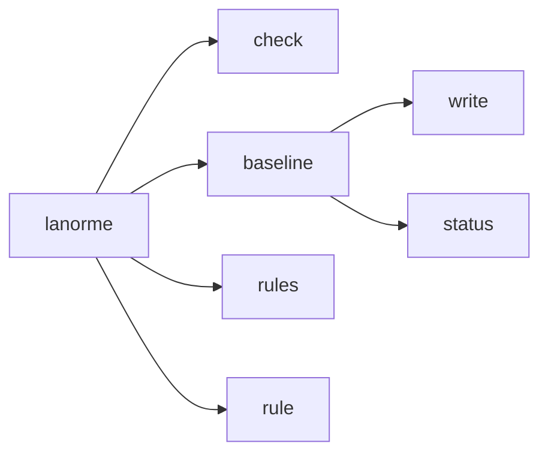

# CLI reference

This reference describes every `lanorme` command, subcommand, argument, and flag, together with the config-discovery order, output formats, and exit codes.

The descriptions follow `lanorme <command> --help`, with the config key each
flag overrides added. For the configuration keys themselves, see the
[configuration reference](configuration.md). For what each rule catches, see
the [rule reference](../RULES.md) and the [rule index](rules-index.md).

## Synopsis

```text
lanorme [-h] [--version] {check,baseline,rules,rule} ...
```

| Option | Effect |
| --- | --- |
| `-h`, `--help` | Show help and exit. |
| `--version` | Print the program version and exit, as `lanorme X.Y.Z`. |

The four subcommands:

| Command | Purpose |
| --- | --- |
| [`check`](#check) | Run checks against one or more paths. |
| [`baseline`](#baseline) | Record or inspect the warning baseline. |
| [`rules`](#rules) | List all registered rules and exit. |
| [`rule`](#rule) | Print the reference section for a single rule code. |

Only `baseline` nests further, into `write` and `status`:



## Config discovery

A command that runs checks looks for config in the scan path's directory and
in each parent. In each directory it tries three files, in this order:

1. `lanorme.toml`. Keys live at the **top level** of the file, with no table
   prefix.
2. `.lanorme.toml`, same top-level layout.
3. A `[tool.lanorme]` table in `pyproject.toml`.

The first one found is that directory's config, so a `lanorme.toml` wins over a
`pyproject.toml` table beside it.

```toml
# lanorme.toml: keys at the top level
select = ["SEC", "CMT-001"]
baseline = "lanorme-baseline.json"
```

```toml
# pyproject.toml: the same keys under [tool.lanorme]
[tool.lanorme]
select = ["SEC", "CMT-001"]
baseline = "lanorme-baseline.json"
```

The walk does not stop at the first config. It climbs to the outermost one, or
to the first config that sets `root = true`, whichever it meets first. That
config's directory is the project root. Every finding is reported relative to
it, whichever directory the command ran from, and `per-file-ignores` and
`exclude` globs match against those paths.

Every config between the project root and the scan path is a region, and so is
every config below the scan path. A region's settings cascade over the ones
above it, table by table and key by key. So
`lanorme check tests` with a `tests/lanorme.toml` applies the project's config
plus the subtree's overrides, not the subtree's file alone. Given this tree:

```toml
# lanorme.toml
select = ["SIZE"]

[file_limits]
file_warn_lines = 5
```

```toml
# tests/lanorme.toml
[file_limits]
file_warn_lines = 3
```

`tests/helpers.py` has four lines. The project's `select` and the subtree's
threshold both apply, and the path is relative to the project root:

```console
$ lanorme check tests
[WARN] file_limits
  WARNING: tests/helpers.py:1 — File has 4 effective lines (warn: 3)
    Rule: SIZE-001: File approaching the effective line limit
    Fix: Consider splitting into smaller modules before it grows further
--- file_limits: 0 violations, 1 warnings ---

Summary: 30 checks — 29 passed, 1 warned, 0 failed.
Findings: 0 errors to fix, 1 advisory warning.
Opt-in checks not enabled: 11 ('lanorme check --show-config' lists them).
```

Every check runs from the project root, whichever path the command names.
`lanorme check tests` confines the file walk to `tests/` instead of making it
the root, so checks are handed `tests/helpers.py`, not `helpers.py`, and the
path-based exemptions some checks apply (the `tests/` and `migrations/` skips)
hold; `per-file-ignores` globs such as `"tests/*"` match the same path. Checks
that compare files across the tree (`duplication`, `test_coverage`,
`layer_deps`, `port_coverage`) still see the whole project, so a duplicate of
a scanned file elsewhere in the project is found and `source_root` is read
from the project root; the report is then narrowed to the requested path. Each
region is checked in its own pass under its merged settings, confined the same
way to the files it governs. The
[per-directory config](configuration.md#per-directory-config) section covers
which settings cascade.

A config file that is not valid TOML is a configuration error and exits `2`.

CLI flags override the matching config key for that run. `--show-config`
prints the outermost config file and lists the nested ones between it and the
scan path. It then shows the
`[tool.lanorme]` keys in force (including `extends` and `baseline`) and the
effective per-check settings. Under each check a `keys:` line lists the TOML
keys that check reads:

```console
$ cd tests && lanorme check --show-config .
config file:  /path/to/proj/lanorme.toml (+ nested: /path/to/proj/tests/lanorme.toml)
project root: /path/to/proj

[tool.lanorme]
  select = ['SIZE']

checks (effective settings):
  ...
  file_limits        file_warn_lines=3 file_error_lines=500 func_warn_lines=50 func_error_lines=80 class_method_warn=10 complexity_warn=10 complexity_error=15 param_warn=5 param_error=8
                     keys: class_method_warn, complexity_error, complexity_warn, file_error_lines, file_warn_lines, func_error_lines, func_warn_lines, param_error, param_warn
  ...
```

The absolute paths vary per machine. With no config anywhere, the
`config file:` line says so and names the files it looked for.

### Per-check settings are validated

Every `[tool.lanorme.<check>]` table is checked before the run. A value of the
wrong type or a key the check does not read exits `2`, naming the table and the
key. The wrong types include a quoted number, a bare string where a list is
expected, and a float or `true` where an integer is expected.

```console
$ cat pyproject.toml
[tool.lanorme.file_limits]
file_warn_lines = "300"
$ lanorme check .
ERROR: invalid value for [tool.lanorme.file_limits] file_warn_lines: 'file_warn_lines' must be an integer, got str
  Run 'lanorme check . --show-config' to see the effective settings for every check.
$ echo $?
2
```

A misspelt key names the keys the check does read:

```console
$ cat pyproject.toml
[tool.lanorme.file_limits]
file_warn_line = 300
$ lanorme check .
ERROR: unknown key in [tool.lanorme.file_limits]: 'file_warn_line'.
  Keys this check reads: class_method_warn, complexity_error, complexity_warn, file_error_lines, file_warn_lines, func_error_lines, func_warn_lines, param_error, param_warn.
```

The top level is strict too. A key that is neither a run key (`select`,
`ignore`, `exclude`, `promote`, `extends`, `baseline`, `source_root`,
`plugins`, `per-file-ignores`, `root`) nor the name of a registered check,
plugin checks included, exits `2` and lists both:

```console
$ cat lanorme.toml
selct = ["SIZE"]
$ lanorme check .
ERROR: unknown key in [tool.lanorme]: 'selct'.
  Run keys: baseline, exclude, extends, ignore, per-file-ignores, plugins, promote, root, select, source_root.
  Check tables: attribute_access, comments, docs, docstrings, domain_terms, duplication, file_limits, ...
```

A `[tool.lanorme]` table inside a `lanorme.toml` or `.lanorme.toml` is the
`pyproject.toml` form in the wrong file; it exits `2` with a message saying
the keys go top level there.

## check

Run checks against one or more paths.

```text
lanorme check [-h] [--check SINGLE] [--select SELECT] [--ignore IGNORE]
              [--exclude EXCLUDE] [--promote PROMOTE] [--show-config]
              [--plugin PLUGIN]
              [--output-format {concise,full,json,ndjson,github,summary}]
              [--json] [--no-baseline]
              [paths ...]
```

### Arguments

| Argument | Description |
| --- | --- |
| `paths` | Path(s) to check. Default: `.` (the current directory). |

### Flags

| Flag | Description |
| --- | --- |
| `--check SINGLE` | Run a single check by name (for example `duplication`), or by rule code or category (for example `DRY-001`, `SIZE`). |
| `--select SELECT` | Comma-separated rule codes or categories to run. Overrides config `select`. |
| `--ignore IGNORE` | Comma-separated rule codes or categories to skip. Overrides config `ignore`. |
| `--exclude EXCLUDE` | Comma-separated file-path globs to exclude. Overrides config `exclude`. |
| `--promote PROMOTE` | Comma-separated rule codes or categories whose warnings become build-failing errors, or `ALL`. Overrides config `promote`. |
| `--show-config` | Print the discovered config files, the `[tool.lanorme]` keys in force (including `extends` and `baseline`) and each check's effective settings and TOML keys, then exit. |
| `--plugin PLUGIN` | Plugin module to load. Repeatable. Adds to config `plugins`. |
| `--output-format {concise,full,json,ndjson,github,summary}` | Output format. Default: `concise`. See [output formats](#output-formats). |
| `--json` | Alias for `--output-format=json`. |
| `--no-baseline` | Ignore the configured baseline for this run and report the whole debt. |

`lanorme check --help` ends with the ways to silence a finding: an inline
`# lanorme: ignore[CODE]` (or `# noqa: CODE`), a `per-file-ignores` glob, or a
baseline. The recipes are in
[Configure which checks run](../how-to/configure-checks.md).

For `--select`, `--ignore` and `--promote`, a category name (the part of a code
before the dash, such as `CMT`) covers every code in it and `ALL` covers every
code. `--check` takes a single check name, rule code or category and ignores
`--select`; it honours cascading per-directory config exactly like a full run.
The selection, ignore, exclude and promote keys are documented in the
[configuration reference](configuration.md); a CLI flag wins over its config
key for that run.

An opt-in check that is not enabled reports nothing, so `--check` on one says
so on stderr:

```console
$ lanorme check --check named_args bad.py
Note: named_args is opt-in and not enabled, so it reports nothing. Enable it with [tool.lanorme.named_args] enabled = true (see 'lanorme rule' for its codes).
All 1 checks passed.
Opt-in checks not enabled: 1 ('lanorme check --show-config' lists them).
```

Every selector is validated. `--select`, `--ignore` and `--promote`, their
config counterparts and the codes in `per-file-ignores` accept `ALL`, a rule
code, a category, a category's `-000` notice code (`TYPE-000`), and any code
in a family whose check declares a `CAT-NNN` placeholder (`TERM-042`). A
selector that names no known rule code or category is a usage error: the run
exits `2` with a message on stderr, and `lanorme rules` lists every code and
category.

```console
$ lanorme check --select NOPE .
ERROR: 'select' names no known rule code or category: 'NOPE'.
  Run 'lanorme rules' to list every code and category.
$ echo $?
2
```

`paths` may mix files and directories. The scan walks their common ancestor,
so checks that compare files still see the siblings, and the report is then
narrowed to the named targets. When every requested path falls under an
`exclude` glob, nothing is checked: the run reports a clean tree and prints a
note on stderr saying so, with a hint to pass `--exclude` to override the
configured globs for one run.

Source files are decoded the way the interpreter decodes them, so a UTF-8 BOM
and a `coding:` cookie are honoured. A file the parser rejects, overflows on,
or cannot read is skipped by every check with a `<PREFIX>-000` notice from
those that report one; see [skip notices](../how-to/promote-warnings.md#skip-notices-are-never-promoted).
A check that raises is reported as a `RUN-000` warning whose message carries
the exception type and text, and the rest of the run continues.

### Promotion

`--promote` escalates the named advisory warnings, or `ALL` warnings, to
build-failing errors. A run with only warnings exits `0`; promoting those
warnings turns them into violations and the run exits `1`.

```console
$ lanorme check --check SIZE-003 .
[WARN] file_limits
  WARNING: big.py:1 — Class 'C' has 11 methods (warn: 10)
    Rule: SIZE-003: Class has too many methods
    Fix: Consider decomposing into smaller, focused classes
--- file_limits: 0 violations, 1 warnings ---

Summary: 1 checks — 0 passed, 1 warned, 0 failed.
Findings: 0 errors to fix, 1 advisory warning.
$ echo $?
0
```

```console
$ lanorme check --check SIZE-003 --promote ALL .
[FAIL] file_limits
  VIOLATION: big.py:1 — Class 'C' has 11 methods (warn: 10)
    Rule: SIZE-003: Class has too many methods
    Fix: Consider decomposing into smaller, focused classes
--- file_limits: 1 violations, 0 warnings ---

Summary: 1 checks — 0 passed, 0 warned, 1 failed.
Findings: 1 error to fix, 0 advisory warnings.
$ echo $?
1
```

In the `json` and `ndjson` records a promoted finding carries
`"promoted": true`.

### Baseline interaction

When config sets `baseline`, `check` suppresses every recorded finding and
reports only new debt. `--no-baseline` ignores the baseline and reports the
whole debt. If `baseline` is set but the file does not exist, `check` exits
`2` and tells you to run `lanorme baseline write` first. The
`lanorme baseline` subcommand records and inspects that file.

## baseline

Record or inspect the warning baseline.

```text
lanorme baseline [-h] {write,status} [paths ...]
```

### Arguments

| Argument | Description |
| --- | --- |
| `{write,status}` | `write` records current findings; `status` lists stale entries. |
| `paths` | Project root to scan. Default: `.` |

`baseline` runs over the whole project root and accepts no selection flags.
Passing a file target, or a directory other than the project root, is refused
with exit `2`, because a narrowed write would regenerate the baseline from a
partial run and prune everything out of scope. The file it writes is a JSON
object with a `version` and an `entries` list; each entry carries the file,
the rule code, an anchor (a hash of the source line at the finding), the
severity, the rule's description and a count.

```console
$ lanorme baseline write a.py
ERROR: 'baseline' must run over the whole project root, without file targets or selection flags.
$ echo $?
2
```

The baseline file path comes from the `baseline` config key. When that key is
unset, the default path is `lanorme-baseline.json` at the project root.

### baseline write

Record the current findings into the baseline file. On the first write it
also prints the config block to adopt. Exits `0`.

```console
$ lanorme baseline write .
Wrote 1 baseline entry (1 finding): +1 new, -0 pruned (was 0).

Add this to your configuration and commit the file like a lockfile:

    [tool.lanorme]
    baseline = "lanorme-baseline.json"
```

Matching is content-anchored, not line-number-anchored, so a recorded entry
survives unrelated edits above it. Commit the file like a lockfile. With a
baseline in place, `check` holds the project to account only for findings it
adds.

### baseline status

List baseline entries that match nothing in the current run, the stale debt
to prune. Entries are grouped by file and code, with `(xN)` when one file has
several stale entries for the same code. Exits `0`, and ends quietly when
piped into a reader that stops early.

```console
$ lanorme baseline status .
3 stale baseline entries (matched nothing this run):
  bad.py  CMT-001  (x2)
  ev.py  EVAL-001

Run 'lanorme baseline write' to prune them.
```

When nothing is stale:

```console
$ lanorme baseline status .
Baseline is current: all 1 entries still match a finding.
```

## rules

List all registered rules and exit.

```text
lanorme rules [-h] [--json]
```

Output groups every rule code under its check, with checks sorted by name.
An opt-in check is marked `(opt-in)` and emits nothing until enabled. The
`-000` notices a check can emit when it skips a file (`TYPE-000: parse error`,
`TYPE-000: too deeply nested`, `TYPE-000: unreadable`) and the `RUN-000`
notice for a check that raised are not rules and are not listed.

```console
$ lanorme rules

## attribute_access — Low-level getattr/hasattr/setattr/delattr smells  (opt-in)
  ATTR-001: Avoid hasattr() for type discrimination
  ATTR-002: Avoid getattr/setattr/delattr with a literal attribute name

## comments — Concise, clean comments (commented-out code, verbosity, style)
  CMT-001: No commented-out code
  CMT-002: No verbose comments (block or line too long)
  PROSE-001: No em dashes in comments or docstrings (opt-in)
  PROSE-003: No emoji in comments or docstrings (opt-in)
...
```

`--json` prints the same data as a list of checks, for tools:

```text
[
  {
    "check": "attribute_access",
    "description": "Low-level getattr/hasattr/setattr/delattr smells",
    "opt_in": true,
    "rules": [
      {
        "code": "ATTR-001",
        "rule": "ATTR-001: Avoid hasattr() for type discrimination"
      },
      ...
    ]
  },
  ...
]
```

The same data, with the opt-in column, is in the
[rule index](rules-index.md). Exits `0`.

## rule

Print the reference section for a single rule code.

```text
lanorme rule [-h] [--json] code
```

### Arguments

| Argument | Description |
| --- | --- |
| `code` | The rule code to look up (for example `CMT-001`, `SQL-001`). Case does not matter. |
| `--json` | Print the declaration and the section as one JSON object. |

The output opens with the declared rule string and the check that emits it,
marked `on by default`, `opt-in, enable it in config` when the whole check
ships off, or `opt-in via <setting> = true in [tool.lanorme.<check>]` when the
rule alone waits on a setting (`PROSE-001` on `em_dash`, `NAMING-001` on
`repo_crud`). The reference section follows:

```console
$ lanorme rule CMT-001
CMT-001: No commented-out code
  check: comments (on by default)

### `CMT-001`: No commented-out code

Default-on. Walks every `#` comment and parses its text as Python; if the
result is one of `_CODE_NODES` (imports, assigns, defs, control flow,
...
```

A heading that names the code exactly wins over a heading that names its
family, such as `NAMING-001..004`. A code with no heading of its own prints
its family's section, so `lanorme rule NAMING-003` prints the naming
conventions section. A `#` line inside a fenced code block never ends a
section early.

`--json` returns `{code, rule, check, opt_in, section}`. `rule`, `check` and
`opt_in` are `null` for a code no check declares, such as `TERM-042` from a
`TERM-NNN` family:

```console
$ lanorme rule CMT-001 --json
{
  "code": "CMT-001",
  "rule": "CMT-001: No commented-out code",
  "check": "comments",
  "opt_in": false,
  "section": "### `CMT-001`: No commented-out code\n\nDefault-on. ..."
}
```

An unknown code exits `2`:

```console
$ lanorme rule NOPE-999
ERROR: no reference section found for 'NOPE-999'. Run 'lanorme rules' for the list of emitted codes, or browse docs/RULES.md directly.
$ echo $?
2
```

## Output formats

`check` accepts six formats via `--output-format`.

| Format | Shape |
| --- | --- |
| `concise` | Default. Only checks with findings, then a `Summary:` line counting checks by status, a `Findings:` line counting errors and advisory warnings, and any [notes](#summary-notes). |
| `full` | Every check, including those that passed, with no summary. |
| `json` | One JSON object per check (a single array). `--json` is the alias. |
| `ndjson` | One finding per line, as JSON. |
| `github` | GitHub Actions workflow commands: `::error` for a violation, `::warning` for an advisory. Auto-selected when `GITHUB_ACTIONS=true`. |
| `summary` | Counts only: the totals, then findings by code and by top-level directory. For trees too large to read finding by finding. |

In the `concise` and `full` formats an error is labelled `VIOLATION:` and an
advisory `WARNING:`. Under a `[WARN]` header every finding is a warning; under
a `[FAIL]` header the labels, and the check's footer
(`--- name: N violations, M warnings ---`), tell the two apart.

`concise` reports only checks with findings and ends with a summary. The
`Summary:` line counts checks by status and the `Findings:` line counts the
errors to fix and the advisory warnings across them:

```console
$ lanorme check bad.py
[FAIL] comments
  VIOLATION: bad.py:2 — Commented-out code: x = 2
    Rule: CMT-001: No commented-out code
    Fix: Delete it; version control remembers
--- comments: 1 violations, 0 warnings ---

Summary: 30 checks — 29 passed, 0 warned, 1 failed.
Findings: 1 error to fix, 0 advisory warnings.
Opt-in checks not enabled: 11 ('lanorme check --show-config' lists them).
```

### Summary notes

After the totals, `concise` prints up to three notes, each only when it
applies:

- `Suppressed: N by inline ignores, M by per-file-ignores, K by the baseline.`
  appears when any of the three is non-zero, so a clean run still shows what
  it hid.
- `Opt-in checks not enabled: N ('lanorme check --show-config' lists them).`
  appears when some of the checks the run selected are opt-in and off; under
  `--check` it counts that selection only.
- `Tip: 'lanorme baseline write' records today's findings as debt so that only new ones report (see the adoption tutorial).`
  appears at 25 errors or more when no baseline is configured. The
  [adoption tutorial](../tutorials/adopt-on-existing-codebase.md) walks through
  it.

```console
$ lanorme check .
All 30 checks passed.
Suppressed: 0 by inline ignores, 0 by per-file-ignores, 1 by the baseline.
Opt-in checks not enabled: 11 ('lanorme check --show-config' lists them).
```

### Finding records

`json` emits one object per check, with `violations` and `warnings` arrays of
finding records. `ndjson` emits the same records, one per line. Every record
carries these fields:

| Field | Meaning |
| --- | --- |
| `check` | The check that reported the finding. |
| `severity` | `error` (a violation) or `warning` (an advisory). |
| `file` | The path, relative to the project root. |
| `line` | The 1-based line. `0` or `1` with no position for a whole-file finding. |
| `column` | The 0-based start column, as `ast` counts it, or `null` when the check does not know it. |
| `end_line` | The 1-based last line of the finding, inclusive, or `null`. |
| `end_column` | The 0-based end column, as `ast` counts it, or `null`. |
| `scope` | `span` when the extent is known, `file` for a whole-file finding (line `0` or `1`, no position), else `line`. |
| `code` | The rule code, such as `CMT-001`. |
| `rule` | Always `CODE: description`, the string the check declares. |
| `message` | What is wrong here. |
| `fix` | What to do about it. |
| `promoted` | `true` when `promote` raised a warning to an error. |
| `fingerprint` | 16 hex characters that identify the finding. |

The fingerprint is a hash of the file, the code and the text of the finding's
own line. An edit elsewhere in the file leaves it unchanged. Key on it to tell a
fixed finding from one that only moved.

```console
$ lanorme check --output-format ndjson ev.py
{"check": "security_calls", "severity": "error", "file": "ev.py", "line": 2, "column": 11, "end_line": 2, "end_column": 20, "scope": "span", "code": "EVAL-001", "rule": "EVAL-001: No eval/exec/compile on a non-literal argument", "message": "eval() on a non-literal argument is an RCE primitive", "fix": "Use ast.literal_eval for trusted-shape parsing, or build a dispatch table", "promoted": false, "fingerprint": "2d8b5bcffce02d8e"}
```

Here `ev.py` is:

```python
def run(cmd):
    return eval(cmd)
```

`json` wraps the same records per check:

```console
$ lanorme check --json bad.py
[
  ...
  {
    "check": "comments",
    "status": "FAIL",
    "violations": [
      {
        "check": "comments",
        "severity": "error",
        "file": "bad.py",
        "line": 2,
        "column": 0,
        "end_line": null,
        "end_column": null,
        "scope": "line",
        "code": "CMT-001",
        "rule": "CMT-001: No commented-out code",
        "message": "Commented-out code: x = 2",
        "fix": "Delete it; version control remembers",
        "promoted": false,
        "fingerprint": "40010927d0febec0"
      }
    ],
    "warnings": []
  },
  ...
]
```

Piping any format into a reader that stops early, such as `| head` or a `jq`
filter that exits after its first match, ends the run quietly with the normal
exit code.

### github

`github` emits workflow commands that annotate the diff in a GitHub Actions
run. It is selected automatically when `GITHUB_ACTIONS=true`. The annotation
carries `col`, `endLine` and `endColumn` when the check knows them; workflow
columns are 1-based, so `col` is the record's `column` plus one:

```console
$ lanorme check --output-format github ev.py
::error file=ev.py,line=2,endLine=2,col=12,endColumn=21,title=EVAL-001::eval() on a non-literal argument is an RCE primitive
```

### summary

`summary` prints the totals, then the finding counts by code (with severity)
and by top-level directory. A file at the root counts under `./`. Reach for it
on a large tree, before reading the findings one by one:

```console
$ lanorme check --output-format summary .
Summary: 30 checks — 27 passed, 1 warned, 2 failed.
Findings: 3 errors to fix, 1 advisory warning.
By code:
  CMT-001          error    2
  EVAL-001         error    1
  PARAM-001        warning  1
By directory:
  app/                     3
  tests/                   1
```

## Exit codes

| Code | Meaning |
| --- | --- |
| `0` | Clean run, or warnings only. No violations (warnings alone, or a baseline-suppressed run, still exit `0`). |
| `1` | Violations found. |
| `2` | Usage or configuration error. |

Exit `2` covers no subcommand at all, an unknown subcommand, an invalid flag
value (such as a bad `--output-format` choice or an unknown `--check` name), a
selector in `--select`, `--ignore`, `--promote`, their config keys or
`per-file-ignores` that names no known rule code or category, a
nonexistent scan path, a `baseline` write or status given file targets, a
configured baseline file that does not exist, a config file that is not valid
TOML, a mistyped or unknown per-check setting, an unknown profile, and
`lanorme rule <CODE>` with an unknown code.
